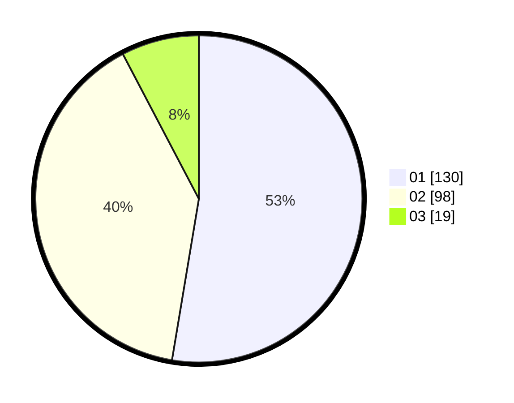

# Hasil

Hasil perolehan suara paslon dapat dilihat pada file paslon-01.txt, paslon-02.txt, dan paslon-03.txt.

Jika tidak ada, artinya data tersebut belum ada pada SIREKAP.

## Perolehan Suara

 * Paslon 01: **130**.
 * Paslon 02: **98**.
 * Paslon 03: **19**.

## Foto C Plano

https://sirekap-obj-formc.kpu.go.id/7676/pemilu/ppwp/31/75/02/10/07/3175021007034-20240215-071048--dec8fd0b-af01-4ae7-8840-a64bb386cd13.jpg

https://sirekap-obj-formc.kpu.go.id/7676/pemilu/ppwp/31/75/02/10/07/3175021007034-20240215-071109--14f74cda-3d1b-4603-b426-6420f4972103.jpg

https://sirekap-obj-formc.kpu.go.id/7676/pemilu/ppwp/31/75/02/10/07/3175021007034-20240215-071058--95683571-64ea-47e0-af9a-d4884d546bb5.jpg

## DATA PEMILIH TETAP

Jumlah pemilih dalam DPT: **277**.
 * L: **138**.
 * P: **139**.

## DATA PENGGUNA HAK PILIH

Jumlah pengguna hak pilih dalam DPT: **239**.
 * L: **111**.
 * P: **128**.

Jumlah pengguna hak pilih dalam DPTb: **10**.
 * L: **7**.
 * P: **3**.

Jumlah pengguna hak pilih dalam DPK: **0**.
 * L: **0**.
 * P: **0**.

Jumlah pengguna hak pilih: **249**.
 * L: **118**.
 * P: **131**.

## JUMLAH SUARA SAH DAN TIDAK SAH

JUMLAH SELURUH SUARA SAH: **247**.

JUMLAH SUARA TIDAK SAH: **2**.

JUMLAH SELURUH SUARA SAH DAN SUARA TIDAK SAH: **249**.
