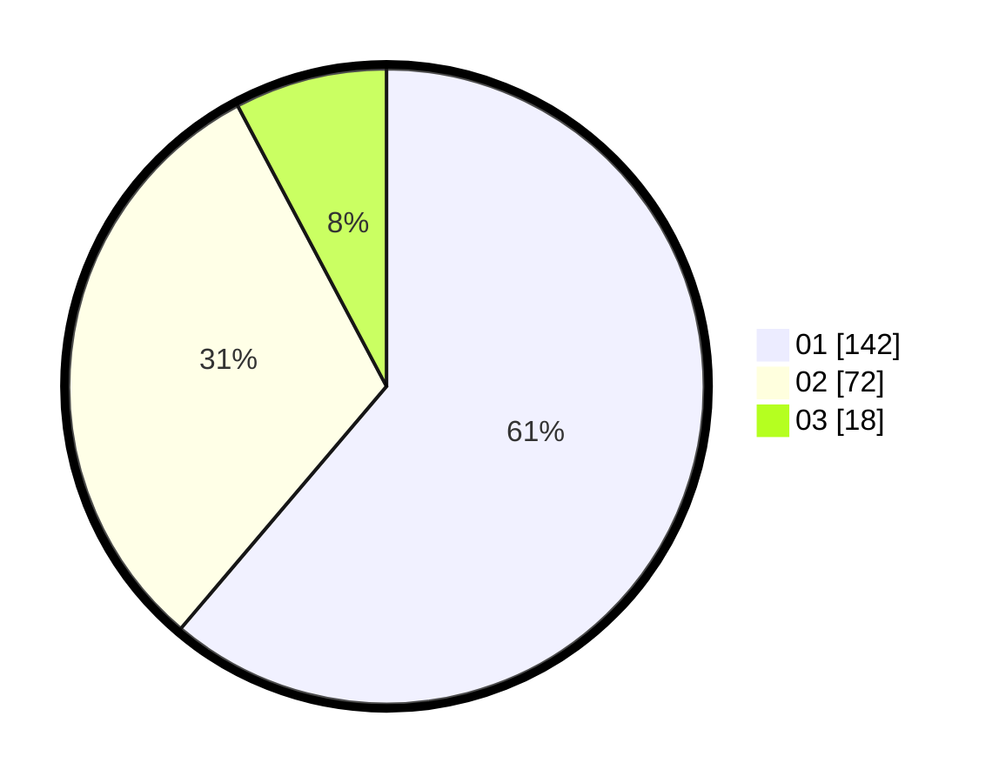

# Hasil

Hasil perolehan suara paslon dapat dilihat pada file paslon-01.txt, paslon-02.txt, dan paslon-03.txt.

Jika tidak ada, artinya data tersebut belum ada pada SIREKAP.

## Perolehan Suara

 * Paslon 01: **142**.
 * Paslon 02: **72**.
 * Paslon 03: **18**.

## Foto C Plano

https://sirekap-obj-formc.kpu.go.id/fe18/pemilu/ppwp/31/75/02/10/07/3175021007037-20240214-215937--e9469a66-3352-402d-ba64-b9e328955cd8.jpg

https://sirekap-obj-formc.kpu.go.id/fe18/pemilu/ppwp/31/75/02/10/07/3175021007037-20240214-221911--6ff26e5c-8847-4f3e-ae30-ad6c2c2db160.jpg

https://sirekap-obj-formc.kpu.go.id/fe18/pemilu/ppwp/31/75/02/10/07/3175021007037-20240214-220230--6b6b69d8-c02d-4f48-91e7-e10816334152.jpg
