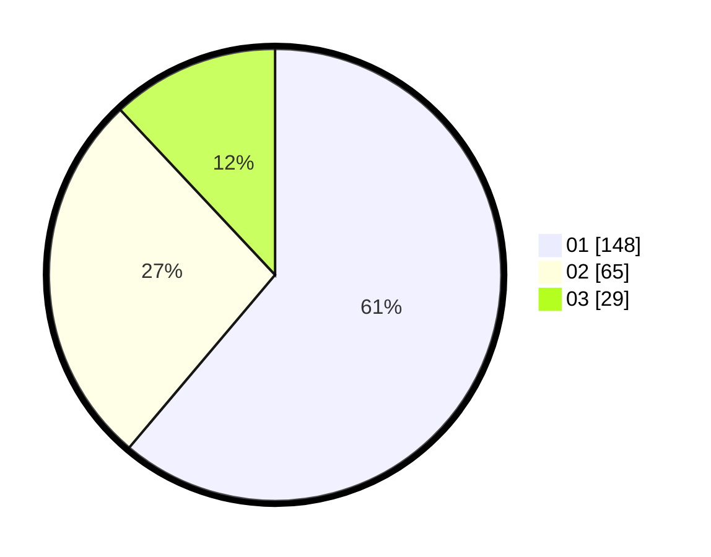

# Hasil

Hasil perolehan suara paslon dapat dilihat pada file paslon-01.txt, paslon-02.txt, dan paslon-03.txt.

Jika tidak ada, artinya data tersebut belum ada pada SIREKAP.

## Perolehan Suara

 * Paslon 01: **148**.
 * Paslon 02: **65**.
 * Paslon 03: **29**.

## Foto C Plano

https://sirekap-obj-formc.kpu.go.id/d365/pemilu/ppwp/31/75/02/10/07/3175021007041-20240214-231035--3f45cdb7-cb49-40a6-89b2-9eed51b0c0e6.jpg

https://sirekap-obj-formc.kpu.go.id/d365/pemilu/ppwp/31/75/02/10/07/3175021007041-20240214-224854--033e0d8f-3a2f-4cdc-add6-6ce57680ba59.jpg

https://sirekap-obj-formc.kpu.go.id/d365/pemilu/ppwp/31/75/02/10/07/3175021007041-20240214-224944--a3b78df8-10df-4316-8567-ba6bc0a8b100.jpg

## DATA PEMILIH TETAP

Jumlah pemilih dalam DPT: **284**.
 * L: **137**.
 * P: **147**.

## DATA PENGGUNA HAK PILIH

Jumlah pengguna hak pilih dalam DPT: **233**.
 * L: **112**.
 * P: **121**.

Jumlah pengguna hak pilih dalam DPTb: **4**.
 * L: **1**.
 * P: **3**.

Jumlah pengguna hak pilih dalam DPK: **6**.
 * L: **4**.
 * P: **2**.

Jumlah pengguna hak pilih: **243**.
 * L: **117**.
 * P: **126**.

## JUMLAH SUARA SAH DAN TIDAK SAH

JUMLAH SELURUH SUARA SAH: **242**.

JUMLAH SUARA TIDAK SAH: **1**.

JUMLAH SELURUH SUARA SAH DAN SUARA TIDAK SAH: **243**.
