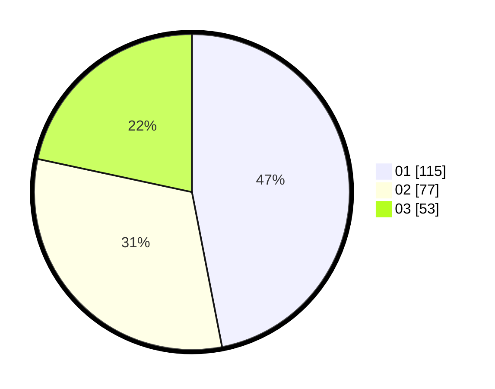

# Hasil

Hasil perolehan suara paslon dapat dilihat pada file paslon-01.txt, paslon-02.txt, dan paslon-03.txt.

Jika tidak ada, artinya data tersebut belum ada pada SIREKAP.

## Perolehan Suara

 * Paslon 01: **115**.
 * Paslon 02: **77**.
 * Paslon 03: **53**.

## Foto C Plano

https://sirekap-obj-formc.kpu.go.id/112e/pemilu/ppwp/31/75/02/10/07/3175021007067-20240214-195956--e6abfa8b-304b-40ea-9026-d795bf2d2a38.jpg

https://sirekap-obj-formc.kpu.go.id/112e/pemilu/ppwp/31/75/02/10/07/3175021007067-20240214-200024--ba136c19-9644-449f-aab9-fb0a37f6aae8.jpg

https://sirekap-obj-formc.kpu.go.id/112e/pemilu/ppwp/31/75/02/10/07/3175021007067-20240214-200047--d0049215-9e92-4ab5-abc7-aa7b02e8eebf.jpg

## DATA PEMILIH TETAP

Jumlah pemilih dalam DPT: **273**.
 * L: **128**.
 * P: **145**.

## DATA PENGGUNA HAK PILIH

Jumlah pengguna hak pilih dalam DPT: **224**.
 * L: **104**.
 * P: **120**.

Jumlah pengguna hak pilih dalam DPTb: **14**.
 * L: **7**.
 * P: **7**.

Jumlah pengguna hak pilih dalam DPK: **5**.
 * L: **2**.
 * P: **3**.

Jumlah pengguna hak pilih: **243**.
 * L: **113**.
 * P: **130**.

## JUMLAH SUARA SAH DAN TIDAK SAH

JUMLAH SELURUH SUARA SAH: **245**.

JUMLAH SUARA TIDAK SAH: **2**.

JUMLAH SELURUH SUARA SAH DAN SUARA TIDAK SAH: **247**.
