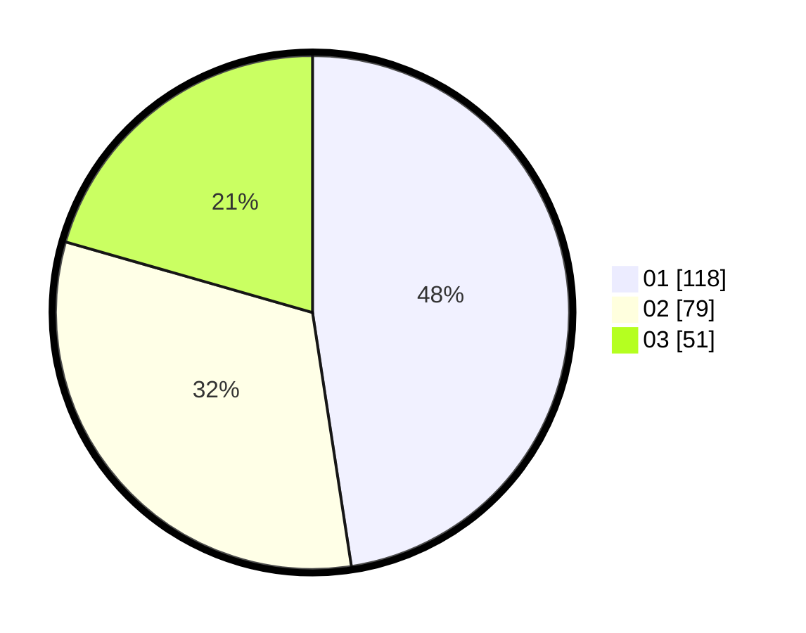

# Hasil

Hasil perolehan suara paslon dapat dilihat pada file paslon-01.txt, paslon-02.txt, dan paslon-03.txt.

Jika tidak ada, artinya data tersebut belum ada pada SIREKAP.

## Perolehan Suara

 * Paslon 01: **118**.
 * Paslon 02: **79**.
 * Paslon 03: **51**.

## Foto C Plano

https://sirekap-obj-formc.kpu.go.id/a4b0/pemilu/ppwp/31/75/02/10/07/3175021007070-20240215-004445--0e574041-7acd-4274-ab86-ad9d94729cfe.jpg

https://sirekap-obj-formc.kpu.go.id/a4b0/pemilu/ppwp/31/75/02/10/07/3175021007070-20240215-004507--cff7ffce-09bd-425a-8de4-afd351d9453b.jpg

https://sirekap-obj-formc.kpu.go.id/a4b0/pemilu/ppwp/31/75/02/10/07/3175021007070-20240215-004456--b86dfed0-a291-40d2-a4d6-6f9a76c41cbe.jpg

## DATA PEMILIH TETAP

Jumlah pemilih dalam DPT: **272**.
 * L: **125**.
 * P: **147**.

## DATA PENGGUNA HAK PILIH

Jumlah pengguna hak pilih dalam DPT: **228**.
 * L: **103**.
 * P: **125**.

Jumlah pengguna hak pilih dalam DPTb: **14**.
 * L: **4**.
 * P: **10**.

Jumlah pengguna hak pilih dalam DPK: **7**.
 * L: **3**.
 * P: **4**.

Jumlah pengguna hak pilih: **249**.
 * L: **110**.
 * P: **139**.

## JUMLAH SUARA SAH DAN TIDAK SAH

JUMLAH SELURUH SUARA SAH: **248**.

JUMLAH SUARA TIDAK SAH: **1**.

JUMLAH SELURUH SUARA SAH DAN SUARA TIDAK SAH: **249**.
