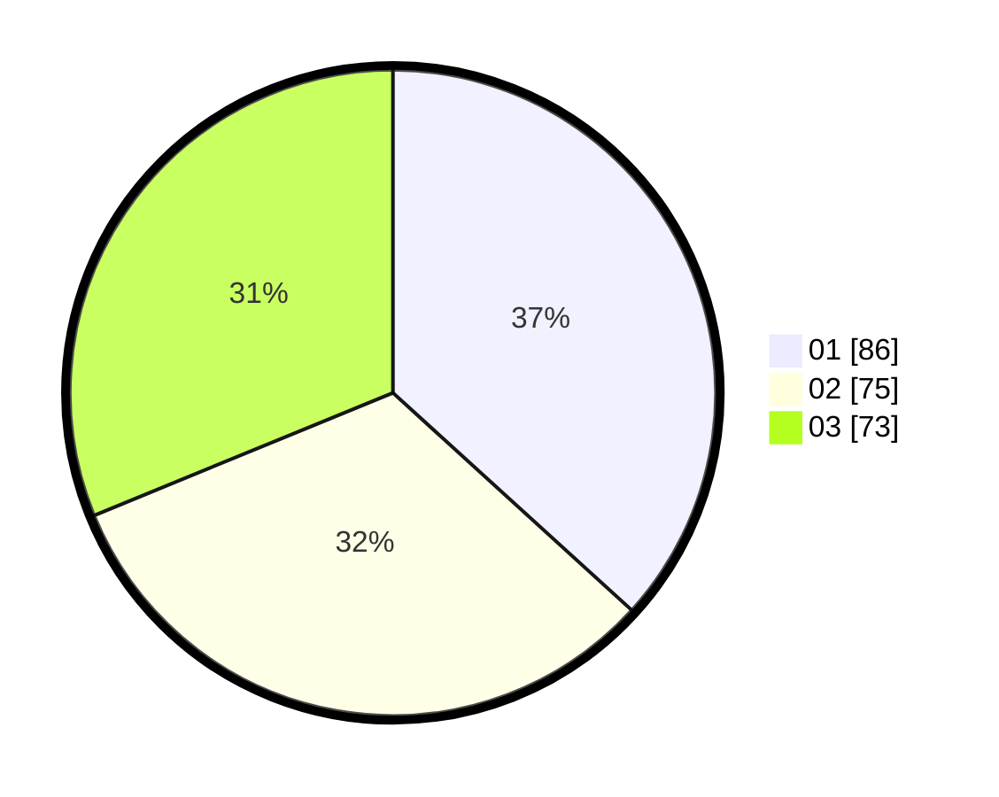

# Hasil

Hasil perolehan suara paslon dapat dilihat pada file paslon-01.txt, paslon-02.txt, dan paslon-03.txt.

Jika tidak ada, artinya data tersebut belum ada pada SIREKAP.

## Perolehan Suara

 * Paslon 01: **86**.
 * Paslon 02: **75**.
 * Paslon 03: **73**.

## Foto C Plano

https://sirekap-obj-formc.kpu.go.id/f819/pemilu/ppwp/31/75/02/10/07/3175021007074-20240214-193605--af204e9a-b01b-4cef-a764-dab83790208b.jpg

https://sirekap-obj-formc.kpu.go.id/f819/pemilu/ppwp/31/75/02/10/07/3175021007074-20240214-193830--0a371589-16a8-4cd2-b2a0-1f3f66fce7fa.jpg

https://sirekap-obj-formc.kpu.go.id/f819/pemilu/ppwp/31/75/02/10/07/3175021007074-20240214-193949--d4548666-59dd-407a-8fbf-fbedaccd5df6.jpg
