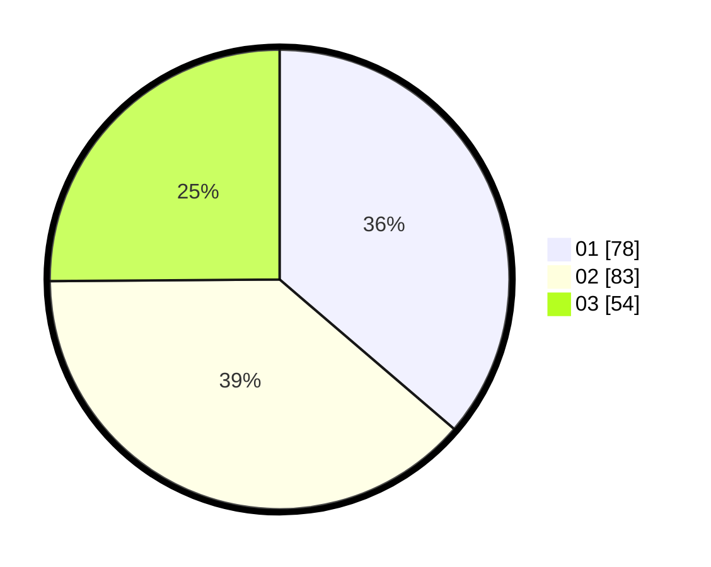

# Hasil

Hasil perolehan suara paslon dapat dilihat pada file paslon-01.txt, paslon-02.txt, dan paslon-03.txt.

Jika tidak ada, artinya data tersebut belum ada pada SIREKAP.

## Perolehan Suara

 * Paslon 01: **78**.
 * Paslon 02: **83**.
 * Paslon 03: **54**.

## Foto C Plano

https://sirekap-obj-formc.kpu.go.id/9356/pemilu/ppwp/31/75/02/10/07/3175021007075-20240214-203339--15a2cf76-6d32-4e0d-a271-cfff34e1dfc9.jpg

https://sirekap-obj-formc.kpu.go.id/9356/pemilu/ppwp/31/75/02/10/07/3175021007075-20240214-203438--a8ae7dad-9158-4bf7-b546-98d840e1b803.jpg

https://sirekap-obj-formc.kpu.go.id/9356/pemilu/ppwp/31/75/02/10/07/3175021007075-20240214-203531--483a1dd8-45de-4286-b527-29be8b6c5397.jpg

## DATA PEMILIH TETAP

Jumlah pemilih dalam DPT: **244**.
 * L: **119**.
 * P: **125**.

## DATA PENGGUNA HAK PILIH

Jumlah pengguna hak pilih dalam DPT: **201**.
 * L: **92**.
 * P: **109**.

Jumlah pengguna hak pilih dalam DPTb: **14**.
 * L: **7**.
 * P: **7**.

Jumlah pengguna hak pilih dalam DPK: **2**.
 * L: **2**.
 * P: **0**.

Jumlah pengguna hak pilih: **217**.
 * L: **101**.
 * P: **116**.

## JUMLAH SUARA SAH DAN TIDAK SAH

JUMLAH SELURUH SUARA SAH: **215**.

JUMLAH SUARA TIDAK SAH: **2**.

JUMLAH SELURUH SUARA SAH DAN SUARA TIDAK SAH: **217**.
