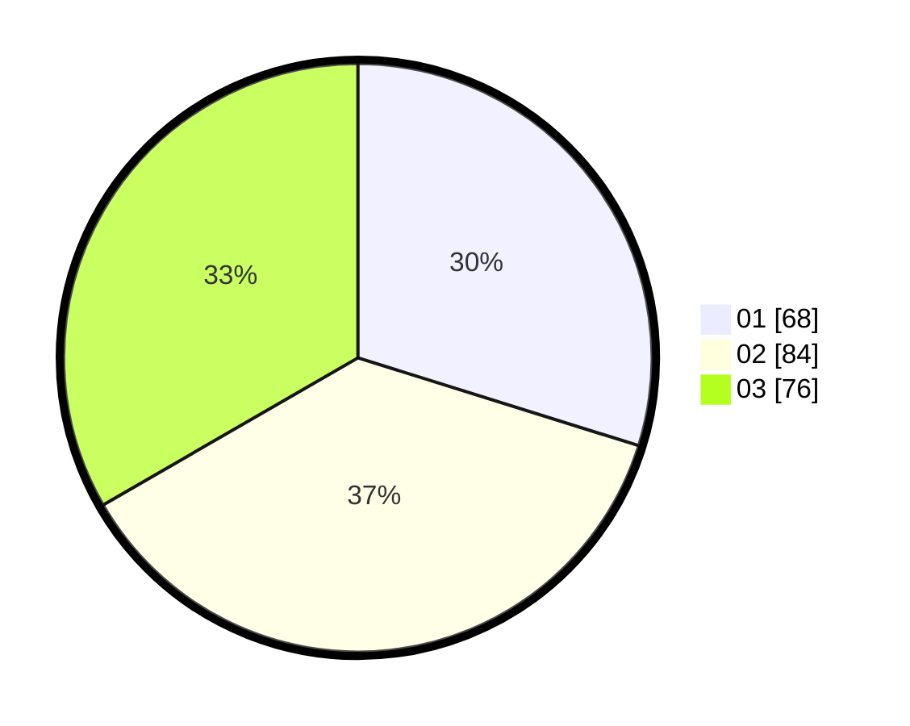

# Hasil

Hasil perolehan suara paslon dapat dilihat pada file paslon-01.txt, paslon-02.txt, dan paslon-03.txt.

Jika tidak ada, artinya data tersebut belum ada pada SIREKAP.

## Perolehan Suara

 * Paslon 01: **68**.
 * Paslon 02: **84**.
 * Paslon 03: **76**.

## Foto C Plano

https://sirekap-obj-formc.kpu.go.id/56ec/pemilu/ppwp/31/75/02/10/07/3175021007084-20240214-193228--6541141a-6dc8-4f78-b42e-85d83748fcb6.jpg

https://sirekap-obj-formc.kpu.go.id/56ec/pemilu/ppwp/31/75/02/10/07/3175021007084-20240214-193615--756a1dd9-e000-4ff1-a511-2f5db9c32c27.jpg

https://sirekap-obj-formc.kpu.go.id/56ec/pemilu/ppwp/31/75/02/10/07/3175021007084-20240214-193946--e7787ba0-c659-41ee-bbb8-efc742a00543.jpg
