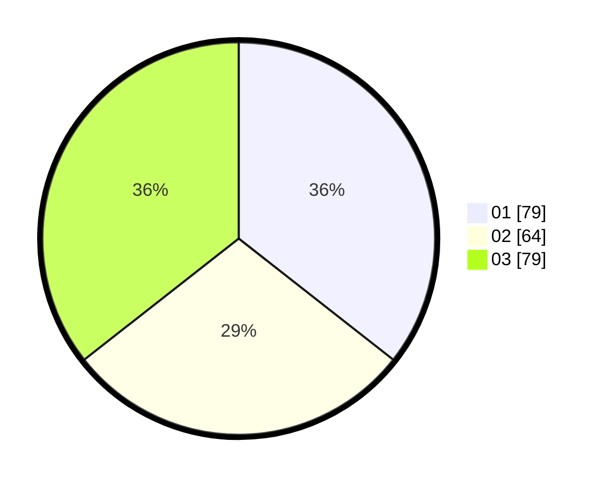

# Hasil

Hasil perolehan suara paslon dapat dilihat pada file paslon-01.txt, paslon-02.txt, dan paslon-03.txt.

Jika tidak ada, artinya data tersebut belum ada pada SIREKAP.

## Perolehan Suara

 * Paslon 01: **79**.
 * Paslon 02: **64**.
 * Paslon 03: **79**.

## Foto C Plano

https://sirekap-obj-formc.kpu.go.id/d4a1/pemilu/ppwp/31/75/02/10/07/3175021007087-20240214-224651--1d69199e-417c-4e28-b277-9fe2df1030e2.jpg

https://sirekap-obj-formc.kpu.go.id/d4a1/pemilu/ppwp/31/75/02/10/07/3175021007087-20240214-224712--8a965eae-6e61-4e51-a52c-1bc58af2e4fe.jpg

https://sirekap-obj-formc.kpu.go.id/d4a1/pemilu/ppwp/31/75/02/10/07/3175021007087-20240214-224737--4a4aa8f3-0519-4ad9-818e-dca077097354.jpg
