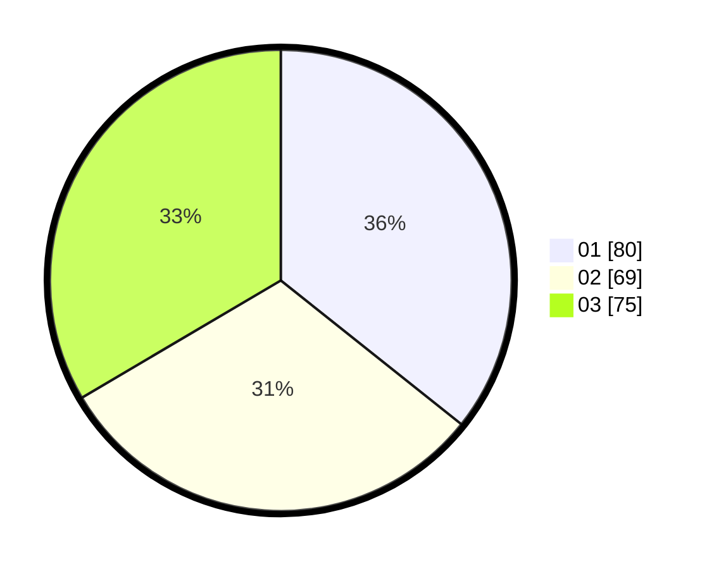

# Hasil

Hasil perolehan suara paslon dapat dilihat pada file paslon-01.txt, paslon-02.txt, dan paslon-03.txt.

Jika tidak ada, artinya data tersebut belum ada pada SIREKAP.

## Perolehan Suara

 * Paslon 01: **80**.
 * Paslon 02: **69**.
 * Paslon 03: **75**.

## Foto C Plano

https://sirekap-obj-formc.kpu.go.id/2e0c/pemilu/ppwp/31/75/02/10/07/3175021007088-20240214-203024--c0deb79e-54bc-4753-8808-c591890913d1.jpg

https://sirekap-obj-formc.kpu.go.id/2e0c/pemilu/ppwp/31/75/02/10/07/3175021007088-20240214-203125--ee1b0aea-c272-4df3-813e-943af191ba36.jpg

https://sirekap-obj-formc.kpu.go.id/2e0c/pemilu/ppwp/31/75/02/10/07/3175021007088-20240214-203201--9d5f3242-dc8e-483b-87f9-0ba5a0abbca6.jpg
