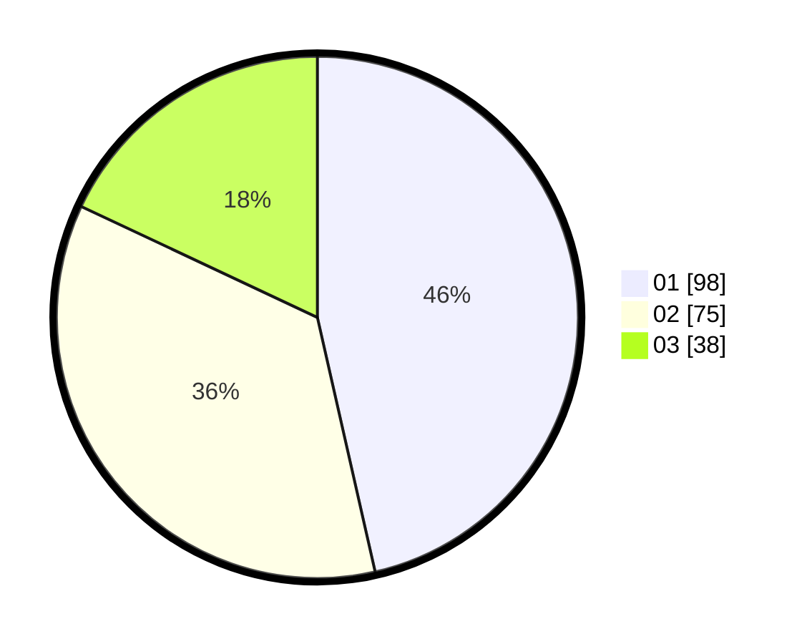

# Hasil

Hasil perolehan suara paslon dapat dilihat pada file paslon-01.txt, paslon-02.txt, dan paslon-03.txt.

Jika tidak ada, artinya data tersebut belum ada pada SIREKAP.

## Perolehan Suara

 * Paslon 01: **98**.
 * Paslon 02: **75**.
 * Paslon 03: **38**.

## Foto C Plano

https://sirekap-obj-formc.kpu.go.id/2e24/pemilu/ppwp/31/75/02/10/07/3175021007097-20240214-202848--6fd3f1f6-c78a-4ec3-9604-f358e8fdd2fd.jpg

https://sirekap-obj-formc.kpu.go.id/2e24/pemilu/ppwp/31/75/02/10/07/3175021007097-20240214-203004--2d0f619d-867f-480b-9abd-76ac7472642f.jpg

https://sirekap-obj-formc.kpu.go.id/2e24/pemilu/ppwp/31/75/02/10/07/3175021007097-20240214-203121--ec18520e-c3f7-4308-af53-03f5996ebfe6.jpg

## DATA PEMILIH TETAP

Jumlah pemilih dalam DPT: **280**.
 * L: **142**.
 * P: **138**.

## DATA PENGGUNA HAK PILIH

Jumlah pengguna hak pilih dalam DPT: **205**.
 * L: **94**.
 * P: **111**.

Jumlah pengguna hak pilih dalam DPTb: **5**.
 * L: **4**.
 * P: **1**.

Jumlah pengguna hak pilih dalam DPK: **2**.
 * L: **1**.
 * P: **1**.

Jumlah pengguna hak pilih: **212**.
 * L: **99**.
 * P: **113**.

## JUMLAH SUARA SAH DAN TIDAK SAH

JUMLAH SELURUH SUARA SAH: **211**.

JUMLAH SUARA TIDAK SAH: **1**.

JUMLAH SELURUH SUARA SAH DAN SUARA TIDAK SAH: **212**.
