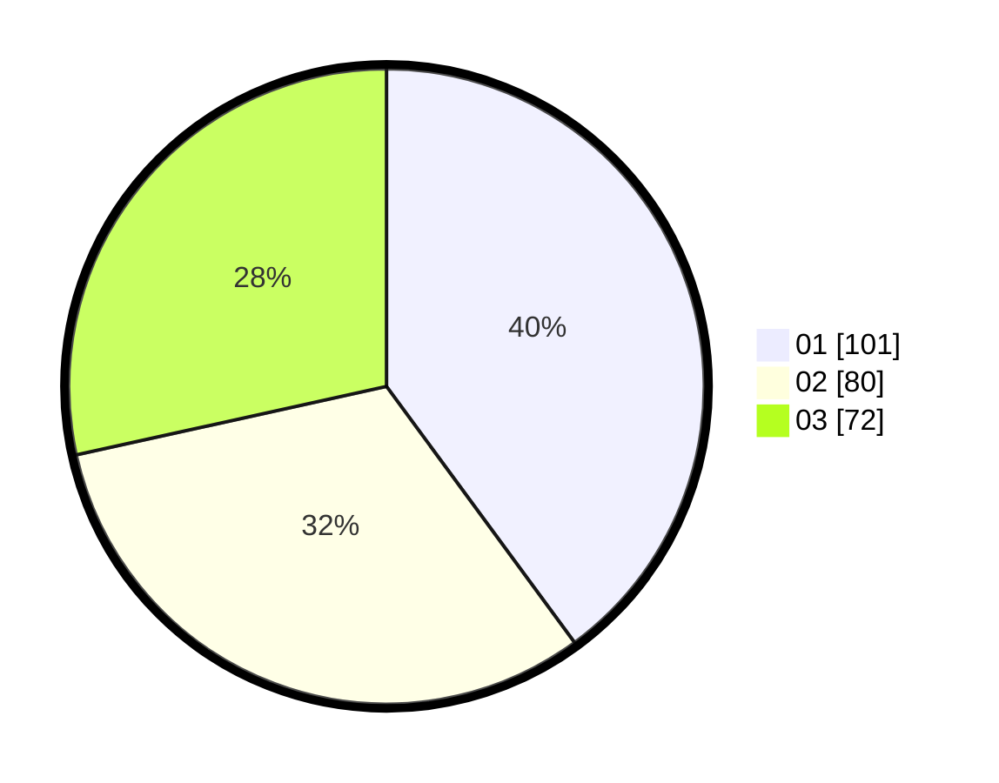

# Hasil

Hasil perolehan suara paslon dapat dilihat pada file paslon-01.txt, paslon-02.txt, dan paslon-03.txt.

Jika tidak ada, artinya data tersebut belum ada pada SIREKAP.

## Perolehan Suara

 * Paslon 01: **101**.
 * Paslon 02: **80**.
 * Paslon 03: **72**.

## Foto C Plano

https://sirekap-obj-formc.kpu.go.id/4133/pemilu/ppwp/31/75/02/10/07/3175021007099-20240215-204313--06772f19-ddf5-4e87-a206-6b0a22a06e97.jpg

https://sirekap-obj-formc.kpu.go.id/4133/pemilu/ppwp/31/75/02/10/07/3175021007099-20240215-204315--42c1753a-66db-403b-8ebe-653d22342b77.jpg

https://sirekap-obj-formc.kpu.go.id/4133/pemilu/ppwp/31/75/02/10/07/3175021007099-20240215-204314--74d05cf6-56de-4784-aa67-93d939bd6b7d.jpg

## DATA PEMILIH TETAP

Jumlah pemilih dalam DPT: **293**.
 * L: **149**.
 * P: **144**.

## DATA PENGGUNA HAK PILIH

Jumlah pengguna hak pilih dalam DPT: **248**.
 * L: **128**.
 * P: **120**.

Jumlah pengguna hak pilih dalam DPTb: **8**.
 * L: **2**.
 * P: **6**.

Jumlah pengguna hak pilih dalam DPK: **1**.
 * L: **0**.
 * P: **1**.

Jumlah pengguna hak pilih: **257**.
 * L: **130**.
 * P: **127**.

## JUMLAH SUARA SAH DAN TIDAK SAH

JUMLAH SELURUH SUARA SAH: **253**.

JUMLAH SUARA TIDAK SAH: **4**.

JUMLAH SELURUH SUARA SAH DAN SUARA TIDAK SAH: **257**.
