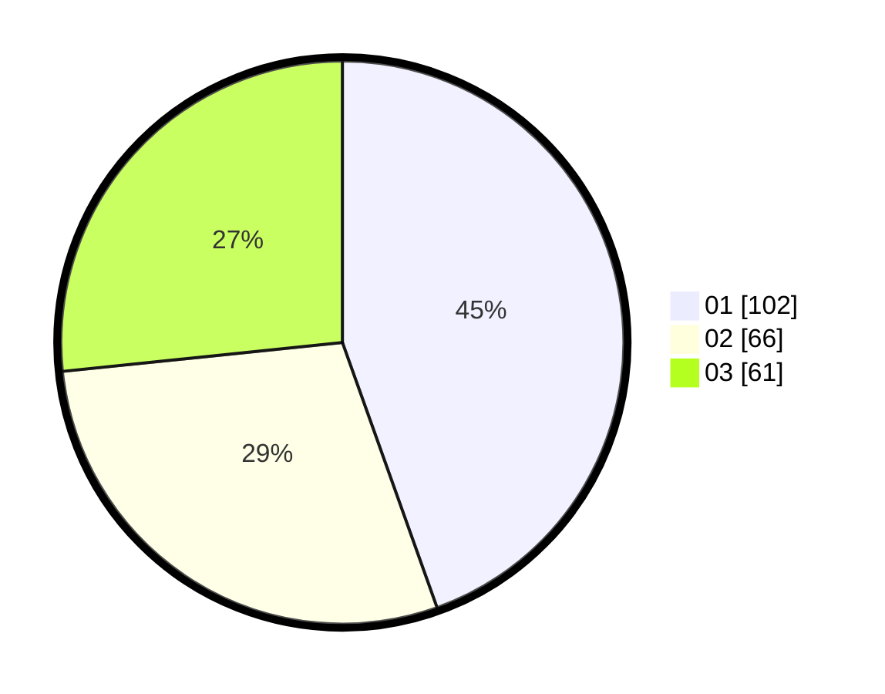

# Hasil

Hasil perolehan suara paslon dapat dilihat pada file paslon-01.txt, paslon-02.txt, dan paslon-03.txt.

Jika tidak ada, artinya data tersebut belum ada pada SIREKAP.

## Perolehan Suara

 * Paslon 01: **102**.
 * Paslon 02: **66**.
 * Paslon 03: **61**.

## Foto C Plano

https://sirekap-obj-formc.kpu.go.id/d07b/pemilu/ppwp/31/75/02/10/07/3175021007103-20240214-192514--99da7a35-e061-415d-a5a2-c61784518328.jpg

https://sirekap-obj-formc.kpu.go.id/d07b/pemilu/ppwp/31/75/02/10/07/3175021007103-20240214-192521--040ce575-45cb-4015-a048-5a1c979cac27.jpg

https://sirekap-obj-formc.kpu.go.id/d07b/pemilu/ppwp/31/75/02/10/07/3175021007103-20240214-192527--af9fd165-888a-410b-a170-efa210179da0.jpg

## DATA PEMILIH TETAP

Jumlah pemilih dalam DPT: **293**.
 * L: **124**.
 * P: **169**.

## DATA PENGGUNA HAK PILIH

Jumlah pengguna hak pilih dalam DPT: **233**.
 * L: **97**.
 * P: **136**.

Jumlah pengguna hak pilih dalam DPTb: **5**.
 * L: **2**.
 * P: **3**.

Jumlah pengguna hak pilih dalam DPK: **5**.
 * L: **2**.
 * P: **3**.

Jumlah pengguna hak pilih: **243**.
 * L: **101**.
 * P: **142**.

## JUMLAH SUARA SAH DAN TIDAK SAH

JUMLAH SELURUH SUARA SAH: **229**.

JUMLAH SUARA TIDAK SAH: **14**.

JUMLAH SELURUH SUARA SAH DAN SUARA TIDAK SAH: **243**.
