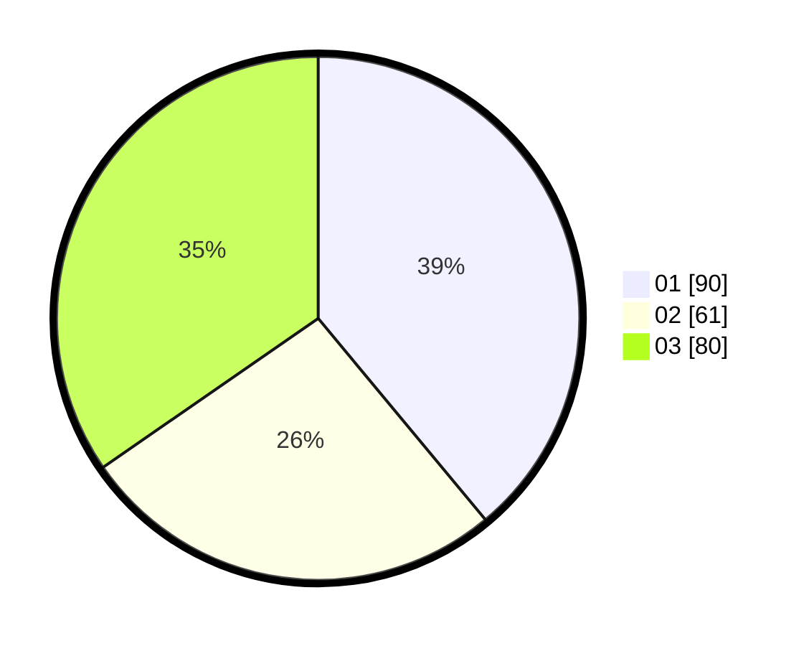

# Hasil

Hasil perolehan suara paslon dapat dilihat pada file paslon-01.txt, paslon-02.txt, dan paslon-03.txt.

Jika tidak ada, artinya data tersebut belum ada pada SIREKAP.

## Perolehan Suara

 * Paslon 01: **90**.
 * Paslon 02: **61**.
 * Paslon 03: **80**.

## Foto C Plano

https://sirekap-obj-formc.kpu.go.id/7d6a/pemilu/ppwp/31/75/02/10/07/3175021007105-20240214-190516--2fb06dcd-a528-44be-baeb-2f4acb7f5be4.jpg

https://sirekap-obj-formc.kpu.go.id/7d6a/pemilu/ppwp/31/75/02/10/07/3175021007105-20240214-200509--4ebe1d35-1eac-4665-82c5-6bfaa2d66574.jpg

https://sirekap-obj-formc.kpu.go.id/7d6a/pemilu/ppwp/31/75/02/10/07/3175021007105-20240214-200709--b3f72e34-5204-4745-8f08-369e0daab741.jpg

## DATA PEMILIH TETAP

Jumlah pemilih dalam DPT: **289**.
 * L: **129**.
 * P: **160**.

## DATA PENGGUNA HAK PILIH

Jumlah pengguna hak pilih dalam DPT: **217**.
 * L: **96**.
 * P: **121**.

Jumlah pengguna hak pilih dalam DPTb: **15**.
 * L: **6**.
 * P: **9**.

Jumlah pengguna hak pilih dalam DPK: **2**.
 * L: **0**.
 * P: **2**.

Jumlah pengguna hak pilih: **234**.
 * L: **102**.
 * P: **132**.

## JUMLAH SUARA SAH DAN TIDAK SAH

JUMLAH SELURUH SUARA SAH: **231**.

JUMLAH SUARA TIDAK SAH: **3**.

JUMLAH SELURUH SUARA SAH DAN SUARA TIDAK SAH: **234**.
