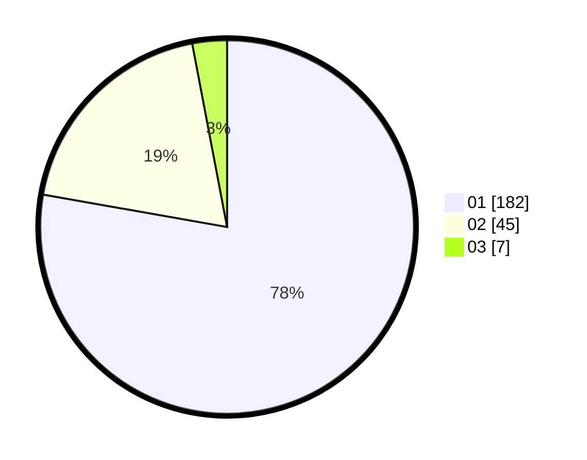

# Hasil

Hasil perolehan suara paslon dapat dilihat pada file paslon-01.txt, paslon-02.txt, dan paslon-03.txt.

Jika tidak ada, artinya data tersebut belum ada pada SIREKAP.

## Perolehan Suara

 * Paslon 01: **182**.
 * Paslon 02: **45**.
 * Paslon 03: **7**.

## Foto C Plano

https://sirekap-obj-formc.kpu.go.id/1c09/pemilu/ppwp/31/75/03/10/01/3175031001007-20240216-152414--4cdd30fd-ce8f-44c1-84d8-4d050d25adc4.jpg

https://sirekap-obj-formc.kpu.go.id/1c09/pemilu/ppwp/31/75/03/10/01/3175031001007-20240216-152615--c98f3c2a-e480-4a28-af4b-b263ea18f699.jpg
