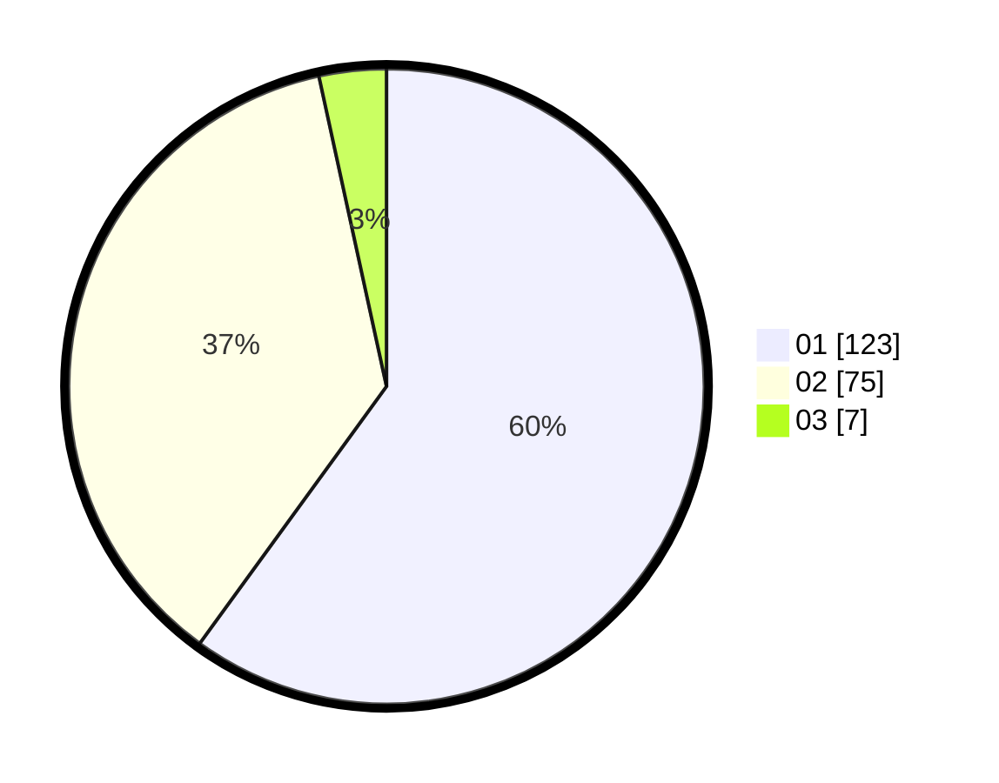

# Hasil

Hasil perolehan suara paslon dapat dilihat pada file paslon-01.txt, paslon-02.txt, dan paslon-03.txt.

Jika tidak ada, artinya data tersebut belum ada pada SIREKAP.

## Perolehan Suara

 * Paslon 01: **123**.
 * Paslon 02: **75**.
 * Paslon 03: **7**.

## Foto C Plano

https://sirekap-obj-formc.kpu.go.id/28c4/pemilu/ppwp/31/75/03/10/01/3175031001010-20240214-235737--e48ca9a7-88f5-4d0c-8c50-dc90ff448a91.jpg

https://sirekap-obj-formc.kpu.go.id/28c4/pemilu/ppwp/31/75/03/10/01/3175031001010-20240214-233500--09286c9c-d7a7-4031-a167-860e98289a4c.jpg

https://sirekap-obj-formc.kpu.go.id/28c4/pemilu/ppwp/31/75/03/10/01/3175031001010-20240214-233534--656b3b40-764c-4818-af84-ff964367c3e3.jpg
