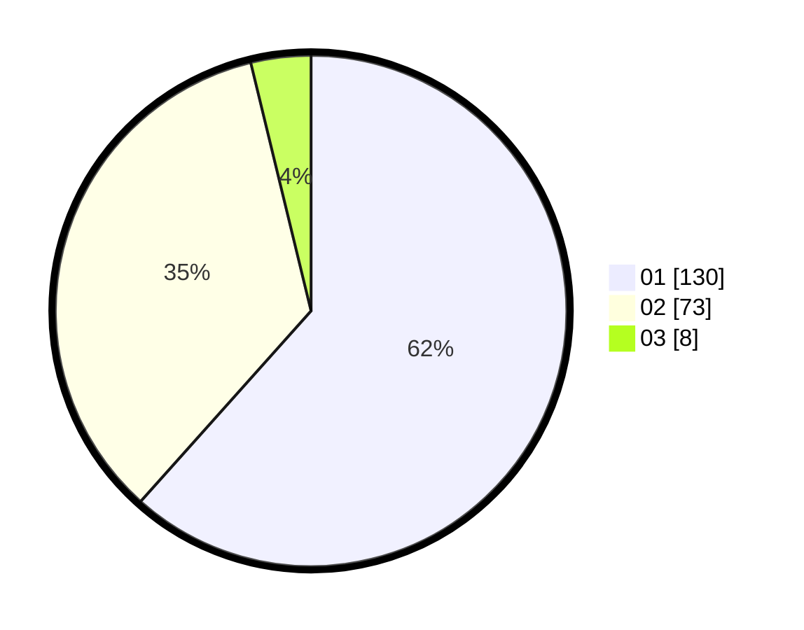

# Hasil

Hasil perolehan suara paslon dapat dilihat pada file paslon-01.txt, paslon-02.txt, dan paslon-03.txt.

Jika tidak ada, artinya data tersebut belum ada pada SIREKAP.

## Perolehan Suara

 * Paslon 01: **130**.
 * Paslon 02: **73**.
 * Paslon 03: **8**.

## Foto C Plano

https://sirekap-obj-formc.kpu.go.id/0420/pemilu/ppwp/31/75/03/10/01/3175031001012-20240214-231323--8d32e327-4a86-4b27-9a3d-0d7e51e3974a.jpg

https://sirekap-obj-formc.kpu.go.id/0420/pemilu/ppwp/31/75/03/10/01/3175031001012-20240214-231916--296217e3-8a29-4694-948c-52ef0972d2d5.jpg

https://sirekap-obj-formc.kpu.go.id/0420/pemilu/ppwp/31/75/03/10/01/3175031001012-20240214-232033--1a32c85d-d34e-44fb-99e4-62e9dcbd5a44.jpg
