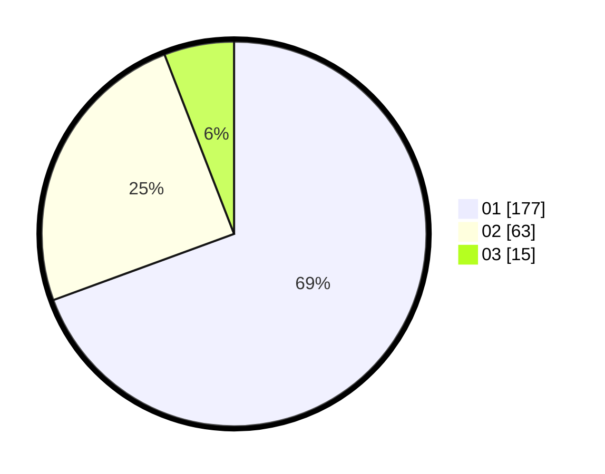

# Hasil

Hasil perolehan suara paslon dapat dilihat pada file paslon-01.txt, paslon-02.txt, dan paslon-03.txt.

Jika tidak ada, artinya data tersebut belum ada pada SIREKAP.

## Perolehan Suara

 * Paslon 01: **177**.
 * Paslon 02: **63**.
 * Paslon 03: **15**.

## Foto C Plano

https://sirekap-obj-formc.kpu.go.id/49a4/pemilu/ppwp/31/75/03/10/01/3175031001013-20240214-212001--9dfc80c1-c945-4008-ac11-7b4b04cf7075.jpg

https://sirekap-obj-formc.kpu.go.id/49a4/pemilu/ppwp/31/75/03/10/01/3175031001013-20240214-205057--4a732d41-bc7a-403d-844d-4158ca280a58.jpg

https://sirekap-obj-formc.kpu.go.id/49a4/pemilu/ppwp/31/75/03/10/01/3175031001013-20240214-205226--35de93ef-3b97-44de-9d3b-5e6d85f069dd.jpg
