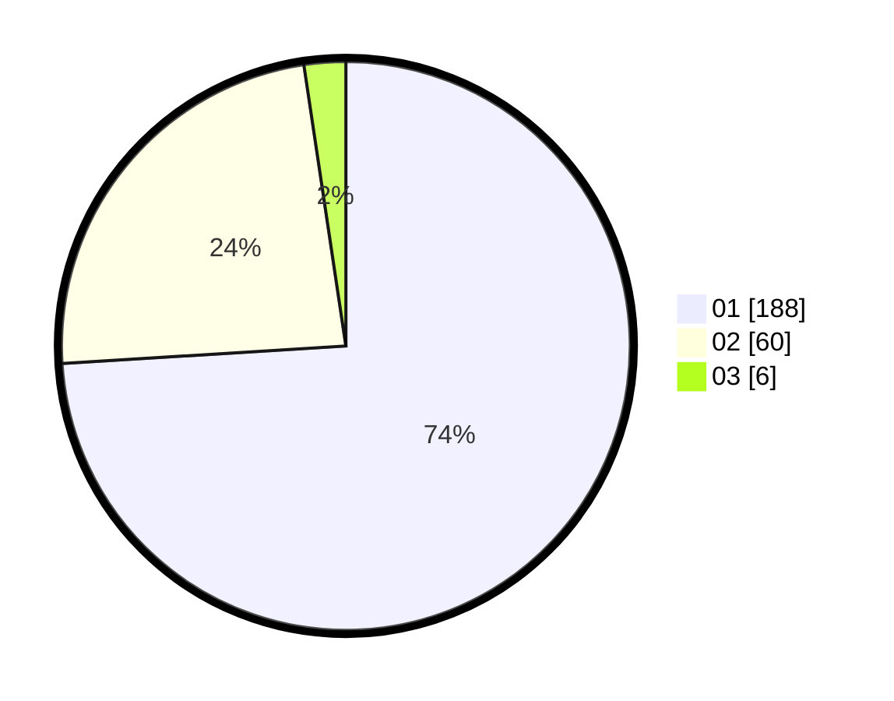

# Hasil

Hasil perolehan suara paslon dapat dilihat pada file paslon-01.txt, paslon-02.txt, dan paslon-03.txt.

Jika tidak ada, artinya data tersebut belum ada pada SIREKAP.

## Perolehan Suara

 * Paslon 01: **188**.
 * Paslon 02: **60**.
 * Paslon 03: **6**.

## Foto C Plano

https://sirekap-obj-formc.kpu.go.id/63ac/pemilu/ppwp/31/75/03/10/01/3175031001015-20240216-133129--3f6b4a5a-a7c5-476c-9349-092c3c062df9.jpg

https://sirekap-obj-formc.kpu.go.id/63ac/pemilu/ppwp/31/75/03/10/01/3175031001015-20240216-133130--6317cbc1-e73c-4805-addf-1c3f613b432f.jpg

https://sirekap-obj-formc.kpu.go.id/63ac/pemilu/ppwp/31/75/03/10/01/3175031001015-20240216-133130--ac405367-452c-40fa-9a90-09d6f7a205a5.jpg

## DATA PEMILIH TETAP

Jumlah pemilih dalam DPT: **292**.
 * L: **143**.
 * P: **149**.

## DATA PENGGUNA HAK PILIH

Jumlah pengguna hak pilih dalam DPT: **248**.
 * L: **118**.
 * P: **130**.

Jumlah pengguna hak pilih dalam DPTb: **1**.
 * L: **1**.
 * P: **0**.

Jumlah pengguna hak pilih dalam DPK: **5**.
 * L: **2**.
 * P: **3**.

Jumlah pengguna hak pilih: **254**.
 * L: **121**.
 * P: **133**.

## JUMLAH SUARA SAH DAN TIDAK SAH

JUMLAH SELURUH SUARA SAH: **254**.

JUMLAH SUARA TIDAK SAH: **0**.

JUMLAH SELURUH SUARA SAH DAN SUARA TIDAK SAH: **254**.
