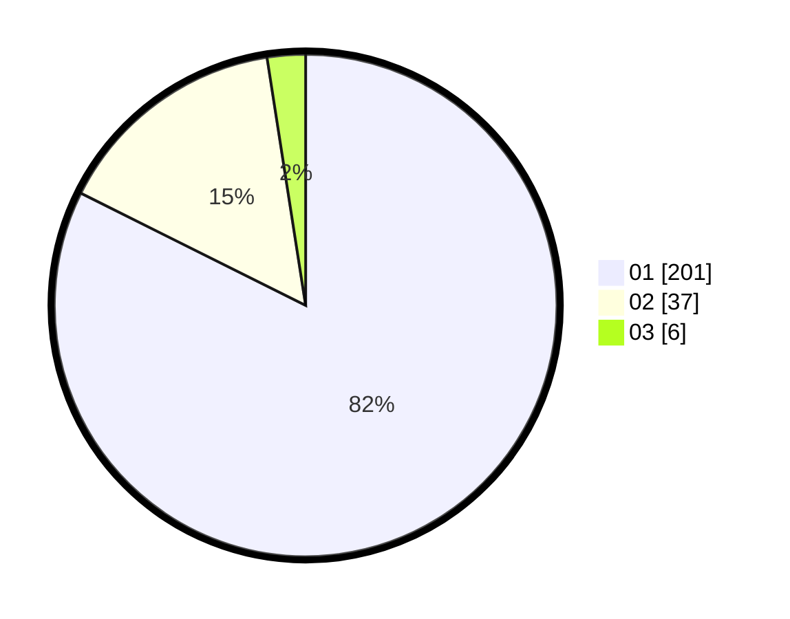

# Hasil

Hasil perolehan suara paslon dapat dilihat pada file paslon-01.txt, paslon-02.txt, dan paslon-03.txt.

Jika tidak ada, artinya data tersebut belum ada pada SIREKAP.

## Perolehan Suara

 * Paslon 01: **201**.
 * Paslon 02: **37**.
 * Paslon 03: **6**.

## Foto C Plano

https://sirekap-obj-formc.kpu.go.id/0133/pemilu/ppwp/31/75/03/10/01/3175031001017-20240216-042718--6681137f-46d3-42b0-bbbe-e7a85d8e99ee.jpg

https://sirekap-obj-formc.kpu.go.id/0133/pemilu/ppwp/31/75/03/10/01/3175031001017-20240216-042732--82cabf87-4b04-4eff-9eb3-ee7b2d31c93e.jpg

https://sirekap-obj-formc.kpu.go.id/0133/pemilu/ppwp/31/75/03/10/01/3175031001017-20240216-145544--f4761f34-342b-47ea-9e6b-66cb09b866d3.jpg

## DATA PEMILIH TETAP

Jumlah pemilih dalam DPT: **298**.
 * L: **156**.
 * P: **142**.

## DATA PENGGUNA HAK PILIH

Jumlah pengguna hak pilih dalam DPT: **245**.
 * L: **123**.
 * P: **122**.

Jumlah pengguna hak pilih dalam DPTb: **1**.
 * L: **1**.
 * P: **0**.

Jumlah pengguna hak pilih dalam DPK: **1**.
 * L: **1**.
 * P: **0**.

Jumlah pengguna hak pilih: **247**.
 * L: **125**.
 * P: **122**.

## JUMLAH SUARA SAH DAN TIDAK SAH

JUMLAH SELURUH SUARA SAH: **244**.

JUMLAH SUARA TIDAK SAH: **3**.

JUMLAH SELURUH SUARA SAH DAN SUARA TIDAK SAH: **247**.
