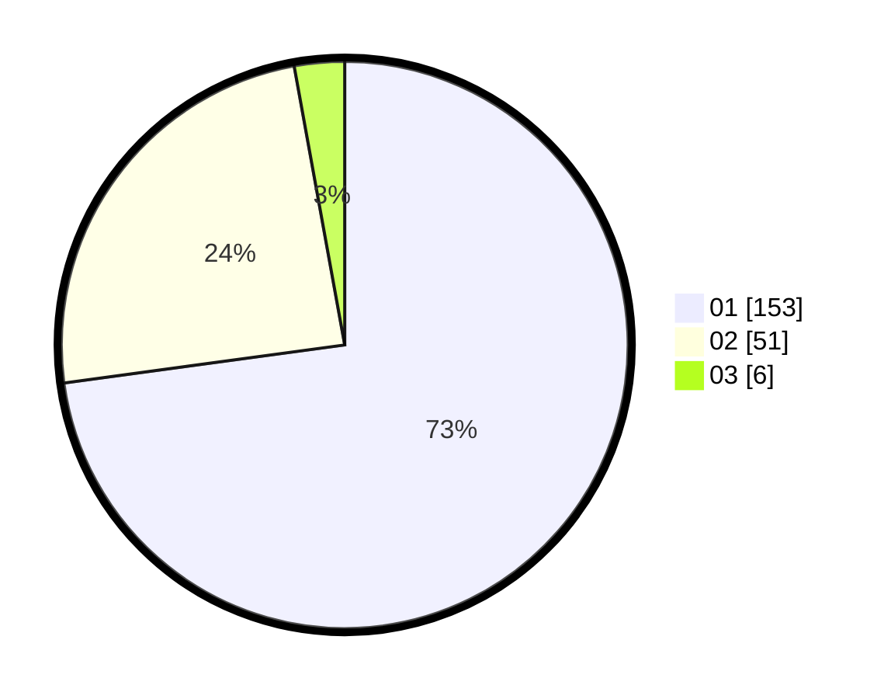

# Hasil

Hasil perolehan suara paslon dapat dilihat pada file paslon-01.txt, paslon-02.txt, dan paslon-03.txt.

Jika tidak ada, artinya data tersebut belum ada pada SIREKAP.

## Perolehan Suara

 * Paslon 01: **153**.
 * Paslon 02: **51**.
 * Paslon 03: **6**.

## Foto C Plano

https://sirekap-obj-formc.kpu.go.id/2d11/pemilu/ppwp/31/75/03/10/01/3175031001021-20240215-213108--113be82c-8d57-4397-aa03-72ec265f33c2.jpg

https://sirekap-obj-formc.kpu.go.id/2d11/pemilu/ppwp/31/75/03/10/01/3175031001021-20240215-213111--18f544a3-9f5c-45b6-bbc5-861145cbae55.jpg

https://sirekap-obj-formc.kpu.go.id/2d11/pemilu/ppwp/31/75/03/10/01/3175031001021-20240215-213109--84eacc1a-9970-4fd5-b811-11c1ad2669e9.jpg

## DATA PEMILIH TETAP

Jumlah pemilih dalam DPT: **256**.
 * L: **122**.
 * P: **134**.

## DATA PENGGUNA HAK PILIH

Jumlah pengguna hak pilih dalam DPT: **211**.
 * L: **97**.
 * P: **114**.

Jumlah pengguna hak pilih dalam DPTb: **2**.
 * L: **2**.
 * P: **0**.

Jumlah pengguna hak pilih dalam DPK: **1**.
 * L: **0**.
 * P: **1**.

Jumlah pengguna hak pilih: **214**.
 * L: **99**.
 * P: **115**.

## JUMLAH SUARA SAH DAN TIDAK SAH

JUMLAH SELURUH SUARA SAH: **210**.

JUMLAH SUARA TIDAK SAH: **4**.

JUMLAH SELURUH SUARA SAH DAN SUARA TIDAK SAH: **214**.
