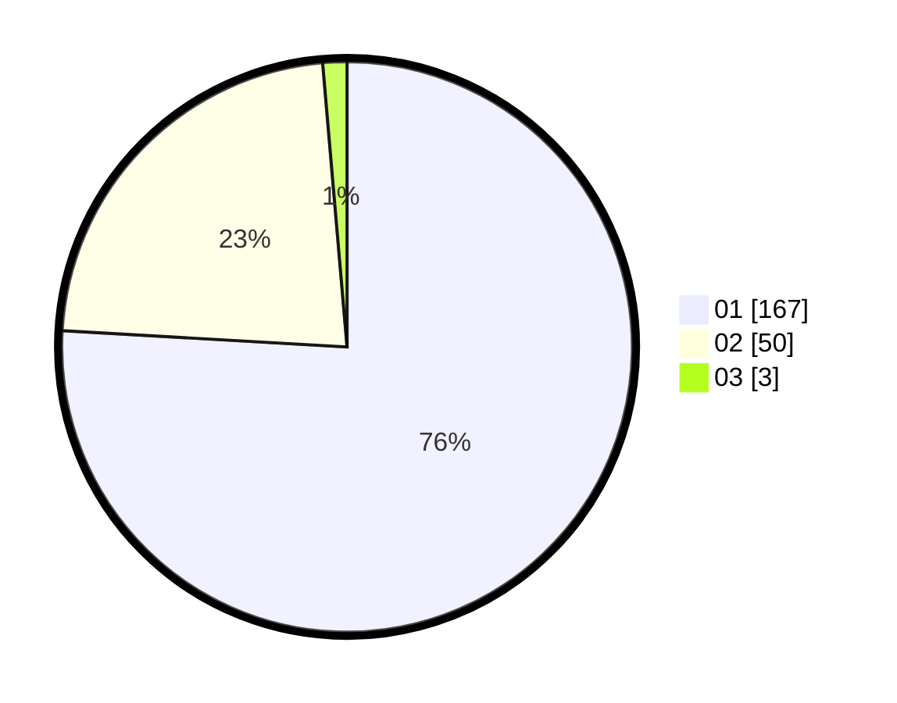

# Hasil

Hasil perolehan suara paslon dapat dilihat pada file paslon-01.txt, paslon-02.txt, dan paslon-03.txt.

Jika tidak ada, artinya data tersebut belum ada pada SIREKAP.

## Perolehan Suara

 * Paslon 01: **167**.
 * Paslon 02: **50**.
 * Paslon 03: **3**.

## Foto C Plano

https://sirekap-obj-formc.kpu.go.id/dae9/pemilu/ppwp/31/75/03/10/01/3175031001022-20240216-005528--bcb7e1a6-3ad4-422a-8565-73b55fe88dda.jpg

https://sirekap-obj-formc.kpu.go.id/dae9/pemilu/ppwp/31/75/03/10/01/3175031001022-20240216-005530--ec9c91f4-d8a4-4d09-ba22-c3e75c11766c.jpg

https://sirekap-obj-formc.kpu.go.id/dae9/pemilu/ppwp/31/75/03/10/01/3175031001022-20240216-005529--19c80e45-4df8-4466-863c-d9ec65e49e8a.jpg

## DATA PEMILIH TETAP

Jumlah pemilih dalam DPT: **267**.
 * L: **121**.
 * P: **146**.

## DATA PENGGUNA HAK PILIH

Jumlah pengguna hak pilih dalam DPT: **222**.
 * L: **97**.
 * P: **125**.

Jumlah pengguna hak pilih dalam DPTb: **0**.
 * L: **0**.
 * P: **0**.

Jumlah pengguna hak pilih dalam DPK: **0**.
 * L: **0**.
 * P: **0**.

Jumlah pengguna hak pilih: **222**.
 * L: **97**.
 * P: **125**.

## JUMLAH SUARA SAH DAN TIDAK SAH

JUMLAH SELURUH SUARA SAH: **220**.

JUMLAH SUARA TIDAK SAH: **2**.

JUMLAH SELURUH SUARA SAH DAN SUARA TIDAK SAH: **222**.
