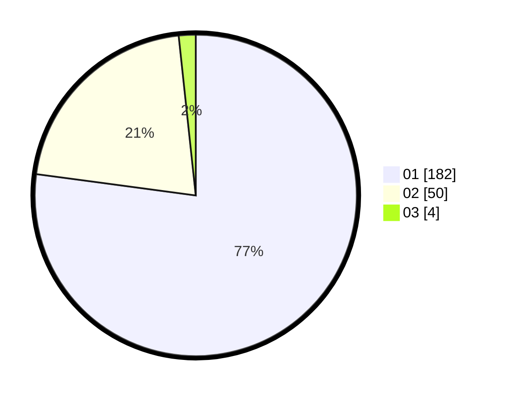

# Hasil

Hasil perolehan suara paslon dapat dilihat pada file paslon-01.txt, paslon-02.txt, dan paslon-03.txt.

Jika tidak ada, artinya data tersebut belum ada pada SIREKAP.

## Perolehan Suara

 * Paslon 01: **182**.
 * Paslon 02: **50**.
 * Paslon 03: **4**.

## Foto C Plano

https://sirekap-obj-formc.kpu.go.id/d3ed/pemilu/ppwp/31/75/03/10/01/3175031001026-20240215-234320--dbae7609-e439-46b0-b980-ca0ba40833b6.jpg

https://sirekap-obj-formc.kpu.go.id/d3ed/pemilu/ppwp/31/75/03/10/01/3175031001026-20240215-234322--048617d4-4e2a-4a02-95b2-f0ec6f7043b1.jpg

https://sirekap-obj-formc.kpu.go.id/d3ed/pemilu/ppwp/31/75/03/10/01/3175031001026-20240215-234321--e5eae9f3-92b0-4bb6-91ea-5b0310753b15.jpg

## DATA PEMILIH TETAP

Jumlah pemilih dalam DPT: **270**.
 * L: **130**.
 * P: **140**.

## DATA PENGGUNA HAK PILIH

Jumlah pengguna hak pilih dalam DPT: **238**.
 * L: **113**.
 * P: **125**.

Jumlah pengguna hak pilih dalam DPTb: **0**.
 * L: **0**.
 * P: **0**.

Jumlah pengguna hak pilih dalam DPK: **3**.
 * L: **2**.
 * P: **1**.

Jumlah pengguna hak pilih: **241**.
 * L: **115**.
 * P: **126**.

## JUMLAH SUARA SAH DAN TIDAK SAH

JUMLAH SELURUH SUARA SAH: **231**.

JUMLAH SUARA TIDAK SAH: **5**.

JUMLAH SELURUH SUARA SAH DAN SUARA TIDAK SAH: **236**.
