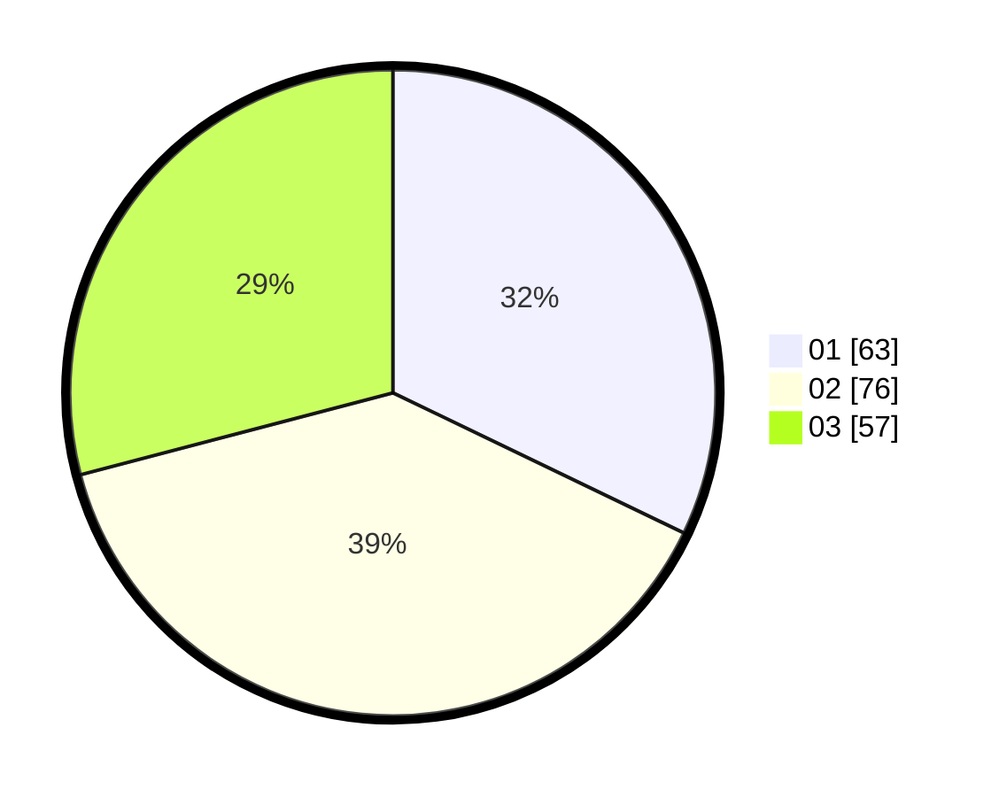

# Hasil

Hasil perolehan suara paslon dapat dilihat pada file paslon-01.txt, paslon-02.txt, dan paslon-03.txt.

Jika tidak ada, artinya data tersebut belum ada pada SIREKAP.

## Perolehan Suara

 * Paslon 01: **63**.
 * Paslon 02: **76**.
 * Paslon 03: **57**.

## Foto C Plano

https://sirekap-obj-formc.kpu.go.id/5946/pemilu/ppwp/31/75/03/10/01/3175031001031-20240216-081757--16d43e88-0025-478b-9098-fd4b73186292.jpg

https://sirekap-obj-formc.kpu.go.id/5946/pemilu/ppwp/31/75/03/10/01/3175031001031-20240216-081802--7e7c4395-5c09-48ab-ac07-2cac82cf094a.jpg

https://sirekap-obj-formc.kpu.go.id/5946/pemilu/ppwp/31/75/03/10/01/3175031001031-20240216-081847--3dcc8098-53f7-4b56-9983-d77e88e9491c.jpg
