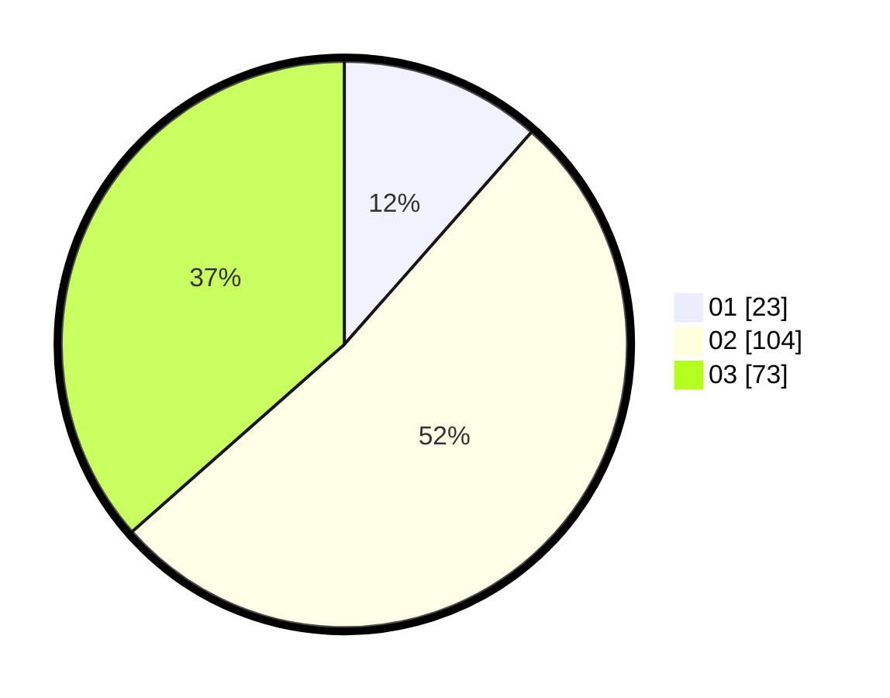

# Hasil

Hasil perolehan suara paslon dapat dilihat pada file paslon-01.txt, paslon-02.txt, dan paslon-03.txt.

Jika tidak ada, artinya data tersebut belum ada pada SIREKAP.

## Perolehan Suara

 * Paslon 01: **23**.
 * Paslon 02: **104**.
 * Paslon 03: **73**.

## Foto C Plano

https://sirekap-obj-formc.kpu.go.id/9688/pemilu/ppwp/31/75/03/10/01/3175031001034-20240214-155055--46585292-902d-4562-8ed3-145fe153c72e.jpg

https://sirekap-obj-formc.kpu.go.id/9688/pemilu/ppwp/31/75/03/10/01/3175031001034-20240214-155102--63fee40d-179c-40de-9c70-9781a80a943f.jpg

https://sirekap-obj-formc.kpu.go.id/9688/pemilu/ppwp/31/75/03/10/01/3175031001034-20240214-155105--ee399cfd-4445-42b5-9496-36b2af01a6f6.jpg

## DATA PEMILIH TETAP

Jumlah pemilih dalam DPT: **259**.
 * L: **133**.
 * P: **126**.

## DATA PENGGUNA HAK PILIH

Jumlah pengguna hak pilih dalam DPT: **202**.
 * L: **99**.
 * P: **103**.

Jumlah pengguna hak pilih dalam DPTb: **0**.
 * L: **0**.
 * P: **0**.

Jumlah pengguna hak pilih dalam DPK: **1**.
 * L: **1**.
 * P: **0**.

Jumlah pengguna hak pilih: **203**.
 * L: **100**.
 * P: **103**.

## JUMLAH SUARA SAH DAN TIDAK SAH

JUMLAH SELURUH SUARA SAH: **200**.

JUMLAH SUARA TIDAK SAH: **3**.

JUMLAH SELURUH SUARA SAH DAN SUARA TIDAK SAH: **203**.
