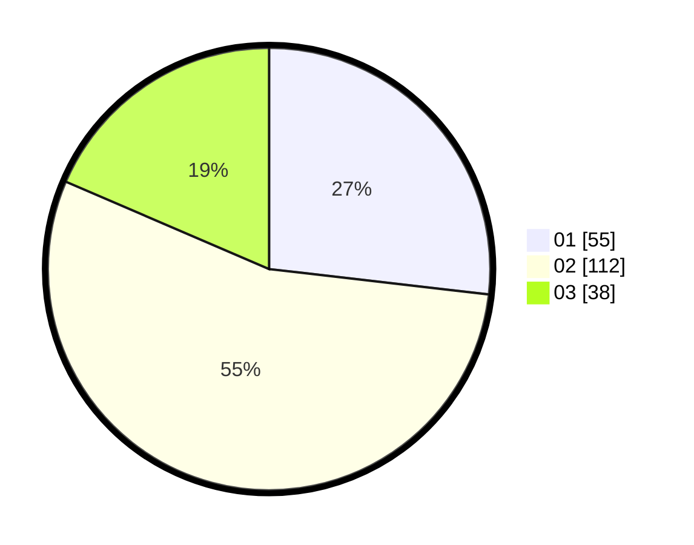

# Hasil

Hasil perolehan suara paslon dapat dilihat pada file paslon-01.txt, paslon-02.txt, dan paslon-03.txt.

Jika tidak ada, artinya data tersebut belum ada pada SIREKAP.

## Perolehan Suara

 * Paslon 01: **55**.
 * Paslon 02: **112**.
 * Paslon 03: **38**.

## Foto C Plano

https://sirekap-obj-formc.kpu.go.id/867f/pemilu/ppwp/31/75/03/10/01/3175031001037-20240214-200648--10d7f192-4456-4272-8d78-fba559e4b522.jpg

https://sirekap-obj-formc.kpu.go.id/867f/pemilu/ppwp/31/75/03/10/01/3175031001037-20240214-200837--791624e9-14db-4550-9e9a-addc47d5dde6.jpg

https://sirekap-obj-formc.kpu.go.id/867f/pemilu/ppwp/31/75/03/10/01/3175031001037-20240214-200805--cc0b6b41-bb5f-4d76-8459-a98d0c0ad817.jpg
