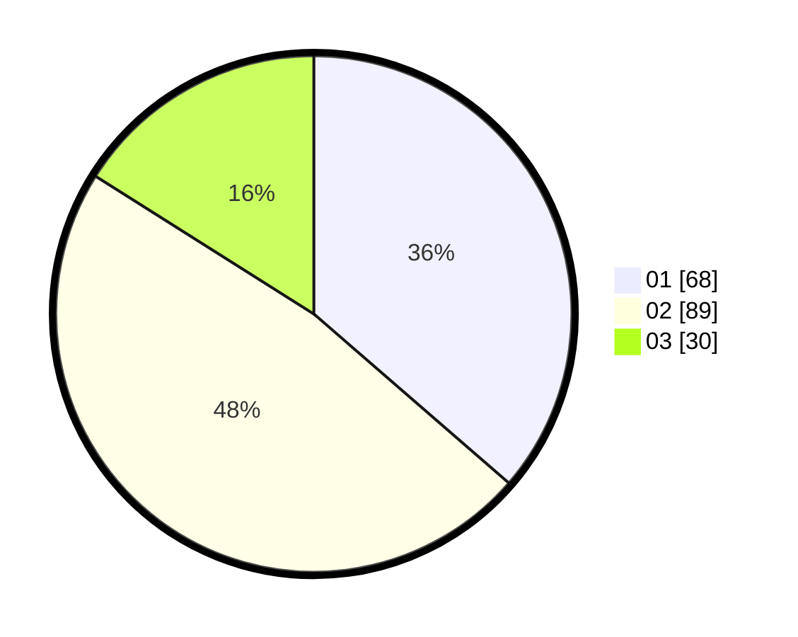

# Hasil

Hasil perolehan suara paslon dapat dilihat pada file paslon-01.txt, paslon-02.txt, dan paslon-03.txt.

Jika tidak ada, artinya data tersebut belum ada pada SIREKAP.

## Perolehan Suara

 * Paslon 01: **68**.
 * Paslon 02: **89**.
 * Paslon 03: **30**.

## Foto C Plano

https://sirekap-obj-formc.kpu.go.id/197f/pemilu/ppwp/31/75/03/10/01/3175031001038-20240214-234821--43086718-6c60-474f-a836-8d6685b3e3b2.jpg

https://sirekap-obj-formc.kpu.go.id/197f/pemilu/ppwp/31/75/03/10/01/3175031001038-20240214-234929--0754481f-6675-4a18-9c95-1c4c71b09d88.jpg

https://sirekap-obj-formc.kpu.go.id/197f/pemilu/ppwp/31/75/03/10/01/3175031001038-20240214-235022--3a3ed6d9-8164-4874-8313-1285e68345d6.jpg
