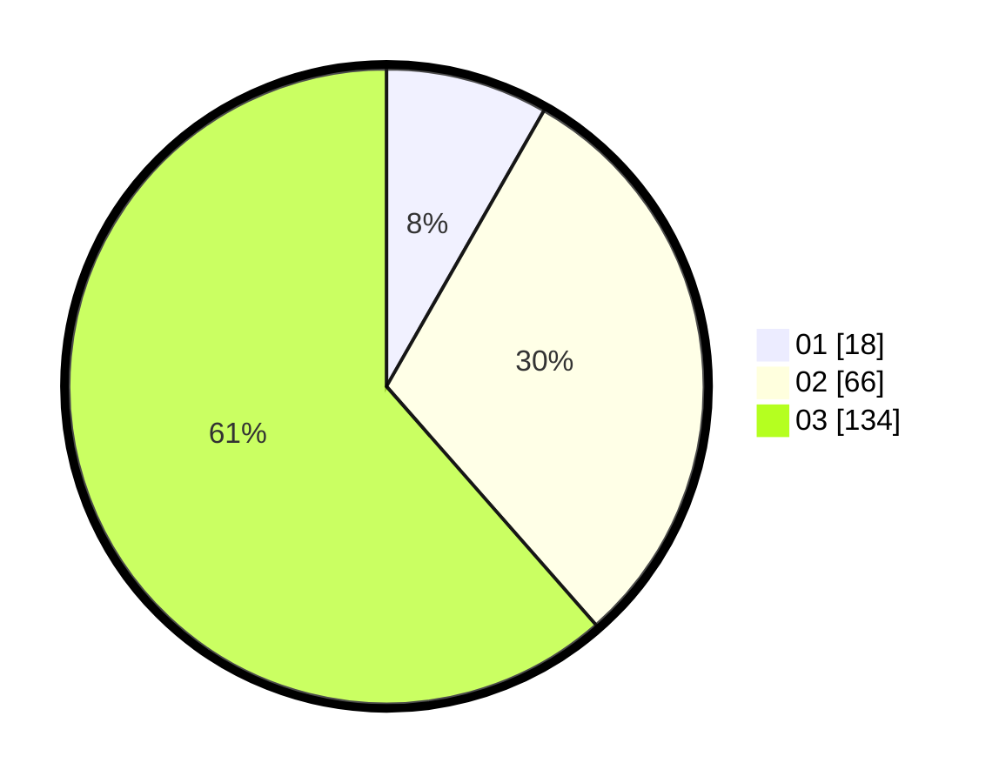

# Hasil

Hasil perolehan suara paslon dapat dilihat pada file paslon-01.txt, paslon-02.txt, dan paslon-03.txt.

Jika tidak ada, artinya data tersebut belum ada pada SIREKAP.

## Perolehan Suara

 * Paslon 01: **18**.
 * Paslon 02: **66**.
 * Paslon 03: **134**.

## Foto C Plano

https://sirekap-obj-formc.kpu.go.id/2f79/pemilu/ppwp/31/75/03/10/01/3175031001040-20240216-141420--2af99928-0ab3-4648-9fef-abb5ae8b4dd6.jpg

https://sirekap-obj-formc.kpu.go.id/2f79/pemilu/ppwp/31/75/03/10/01/3175031001040-20240215-221734--598fdac8-6412-4a04-9967-6275e8250885.jpg

https://sirekap-obj-formc.kpu.go.id/2f79/pemilu/ppwp/31/75/03/10/01/3175031001040-20240215-221732--996cac24-0879-4ccf-9139-d71bb9133435.jpg

## DATA PEMILIH TETAP

Jumlah pemilih dalam DPT: **266**.
 * L: **132**.
 * P: **134**.

## DATA PENGGUNA HAK PILIH

Jumlah pengguna hak pilih dalam DPT: **221**.
 * L: **112**.
 * P: **109**.

Jumlah pengguna hak pilih dalam DPTb: **0**.
 * L: **0**.
 * P: **0**.

Jumlah pengguna hak pilih dalam DPK: **2**.
 * L: **2**.
 * P: **0**.

Jumlah pengguna hak pilih: **223**.
 * L: **114**.
 * P: **109**.

## JUMLAH SUARA SAH DAN TIDAK SAH

JUMLAH SELURUH SUARA SAH: **218**.

JUMLAH SUARA TIDAK SAH: **5**.

JUMLAH SELURUH SUARA SAH DAN SUARA TIDAK SAH: **223**.
