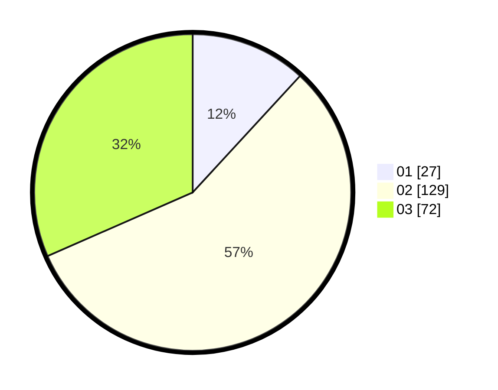

# Hasil

Hasil perolehan suara paslon dapat dilihat pada file paslon-01.txt, paslon-02.txt, dan paslon-03.txt.

Jika tidak ada, artinya data tersebut belum ada pada SIREKAP.

## Perolehan Suara

 * Paslon 01: **27**.
 * Paslon 02: **129**.
 * Paslon 03: **72**.

## Foto C Plano

https://sirekap-obj-formc.kpu.go.id/f57e/pemilu/ppwp/31/75/03/10/01/3175031001048-20240214-222806--bf70faf2-fe6a-4cef-b293-b2cccf2e8082.jpg

https://sirekap-obj-formc.kpu.go.id/f57e/pemilu/ppwp/31/75/03/10/01/3175031001048-20240214-222827--63d99fd6-3014-42cc-b0b5-3a4237e50d36.jpg

https://sirekap-obj-formc.kpu.go.id/f57e/pemilu/ppwp/31/75/03/10/01/3175031001048-20240214-222816--7f61e5ab-885e-425a-94e8-10bdf045682c.jpg

## DATA PEMILIH TETAP

Jumlah pemilih dalam DPT: **296**.
 * L: **138**.
 * P: **158**.

## DATA PENGGUNA HAK PILIH

Jumlah pengguna hak pilih dalam DPT: **226**.
 * L: **110**.
 * P: **116**.

Jumlah pengguna hak pilih dalam DPTb: **3**.
 * L: **0**.
 * P: **3**.

Jumlah pengguna hak pilih dalam DPK: **2**.
 * L: **1**.
 * P: **1**.

Jumlah pengguna hak pilih: **231**.
 * L: **111**.
 * P: **120**.

## JUMLAH SUARA SAH DAN TIDAK SAH

JUMLAH SELURUH SUARA SAH: **228**.

JUMLAH SUARA TIDAK SAH: **3**.

JUMLAH SELURUH SUARA SAH DAN SUARA TIDAK SAH: **231**.
