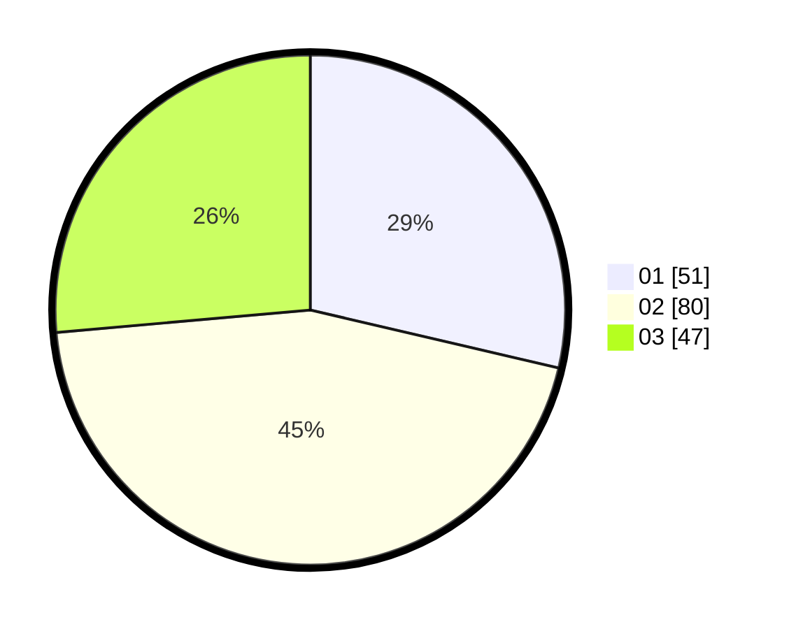

# Hasil

Hasil perolehan suara paslon dapat dilihat pada file paslon-01.txt, paslon-02.txt, dan paslon-03.txt.

Jika tidak ada, artinya data tersebut belum ada pada SIREKAP.

## Perolehan Suara

 * Paslon 01: **51**.
 * Paslon 02: **80**.
 * Paslon 03: **47**.

## Foto C Plano

https://sirekap-obj-formc.kpu.go.id/1d99/pemilu/ppwp/31/75/03/10/01/3175031001049-20240214-192439--8eccc00c-d007-4944-9f8f-0fee12c8f72b.jpg

https://sirekap-obj-formc.kpu.go.id/1d99/pemilu/ppwp/31/75/03/10/01/3175031001049-20240214-192457--2bcdf8cc-94e2-4aaa-a1d3-37c9ddef9b14.jpg

https://sirekap-obj-formc.kpu.go.id/1d99/pemilu/ppwp/31/75/03/10/01/3175031001049-20240214-192502--73378158-a034-49c5-b692-7e6b75984b07.jpg

## DATA PEMILIH TETAP

Jumlah pemilih dalam DPT: **286**.
 * L: **142**.
 * P: **144**.

## DATA PENGGUNA HAK PILIH

Jumlah pengguna hak pilih dalam DPT: **175**.
 * L: **91**.
 * P: **84**.

Jumlah pengguna hak pilih dalam DPTb: **6**.
 * L: **4**.
 * P: **2**.

Jumlah pengguna hak pilih dalam DPK: **0**.
 * L: **0**.
 * P: **0**.

Jumlah pengguna hak pilih: **181**.
 * L: **95**.
 * P: **86**.

## JUMLAH SUARA SAH DAN TIDAK SAH

JUMLAH SELURUH SUARA SAH: **178**.

JUMLAH SUARA TIDAK SAH: **3**.

JUMLAH SELURUH SUARA SAH DAN SUARA TIDAK SAH: **181**.
