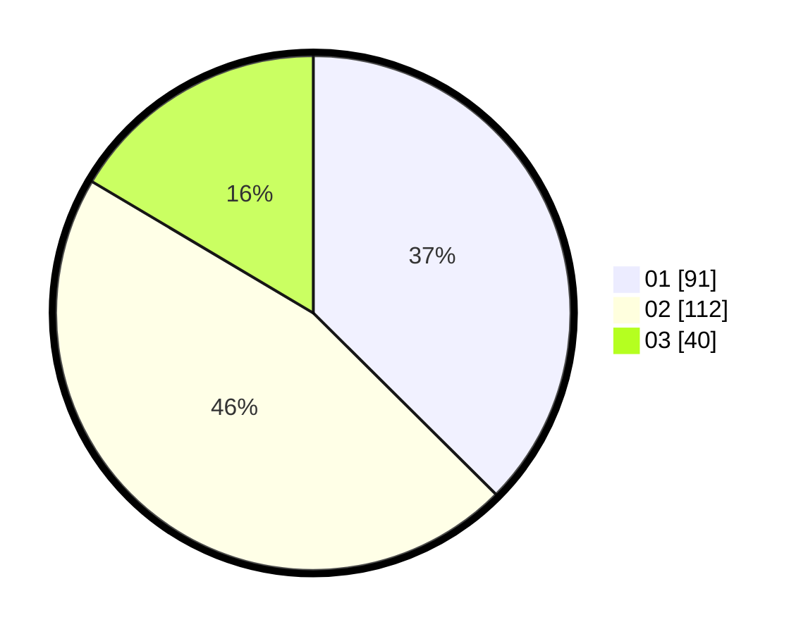

# Hasil

Hasil perolehan suara paslon dapat dilihat pada file paslon-01.txt, paslon-02.txt, dan paslon-03.txt.

Jika tidak ada, artinya data tersebut belum ada pada SIREKAP.

## Perolehan Suara

 * Paslon 01: **91**.
 * Paslon 02: **112**.
 * Paslon 03: **40**.

## Foto C Plano

https://sirekap-obj-formc.kpu.go.id/5677/pemilu/ppwp/31/75/03/10/01/3175031001052-20240216-143631--bc66d952-8af3-4967-9ce3-7e31ec854a5c.jpg

https://sirekap-obj-formc.kpu.go.id/5677/pemilu/ppwp/31/75/03/10/01/3175031001052-20240216-143632--325ff902-bd42-47ac-ab99-e4737f9d33e7.jpg

https://sirekap-obj-formc.kpu.go.id/5677/pemilu/ppwp/31/75/03/10/01/3175031001052-20240216-143631--41b81a97-f1d6-44f1-bb87-1869beaaa195.jpg

## DATA PEMILIH TETAP

Jumlah pemilih dalam DPT: **292**.
 * L: **159**.
 * P: **133**.

## DATA PENGGUNA HAK PILIH

Jumlah pengguna hak pilih dalam DPT: **238**.
 * L: **125**.
 * P: **113**.

Jumlah pengguna hak pilih dalam DPTb: **5**.
 * L: **2**.
 * P: **3**.

Jumlah pengguna hak pilih dalam DPK: **1**.
 * L: **0**.
 * P: **1**.

Jumlah pengguna hak pilih: **244**.
 * L: **127**.
 * P: **117**.

## JUMLAH SUARA SAH DAN TIDAK SAH

JUMLAH SELURUH SUARA SAH: **243**.

JUMLAH SUARA TIDAK SAH: **1**.

JUMLAH SELURUH SUARA SAH DAN SUARA TIDAK SAH: **244**.
