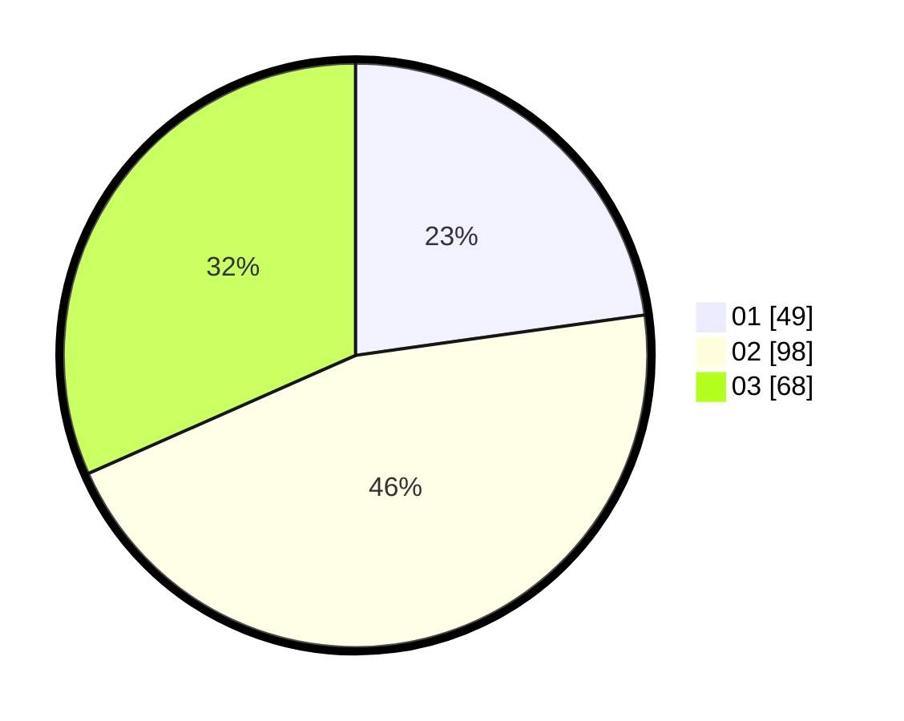

# Hasil

Hasil perolehan suara paslon dapat dilihat pada file paslon-01.txt, paslon-02.txt, dan paslon-03.txt.

Jika tidak ada, artinya data tersebut belum ada pada SIREKAP.

## Perolehan Suara

 * Paslon 01: **49**.
 * Paslon 02: **98**.
 * Paslon 03: **68**.

## Foto C Plano

https://sirekap-obj-formc.kpu.go.id/4789/pemilu/ppwp/31/75/03/10/01/3175031001053-20240216-141505--f1e40e0e-6fcc-413c-a0a1-52ec0bbd31e9.jpg

https://sirekap-obj-formc.kpu.go.id/4789/pemilu/ppwp/31/75/03/10/01/3175031001053-20240216-141507--2eec31f3-63a8-4bbf-9103-274647563b33.jpg

https://sirekap-obj-formc.kpu.go.id/4789/pemilu/ppwp/31/75/03/10/01/3175031001053-20240216-141506--e2416a43-5b0d-4898-8a53-73bf5e0df8fc.jpg

## DATA PEMILIH TETAP

Jumlah pemilih dalam DPT: **287**.
 * L: **138**.
 * P: **149**.

## DATA PENGGUNA HAK PILIH

Jumlah pengguna hak pilih dalam DPT: **218**.
 * L: **102**.
 * P: **116**.

Jumlah pengguna hak pilih dalam DPTb: **0**.
 * L: **0**.
 * P: **0**.

Jumlah pengguna hak pilih dalam DPK: **1**.
 * L: **0**.
 * P: **1**.

Jumlah pengguna hak pilih: **219**.
 * L: **102**.
 * P: **117**.

## JUMLAH SUARA SAH DAN TIDAK SAH

JUMLAH SELURUH SUARA SAH: **215**.

JUMLAH SUARA TIDAK SAH: **4**.

JUMLAH SELURUH SUARA SAH DAN SUARA TIDAK SAH: **219**.
