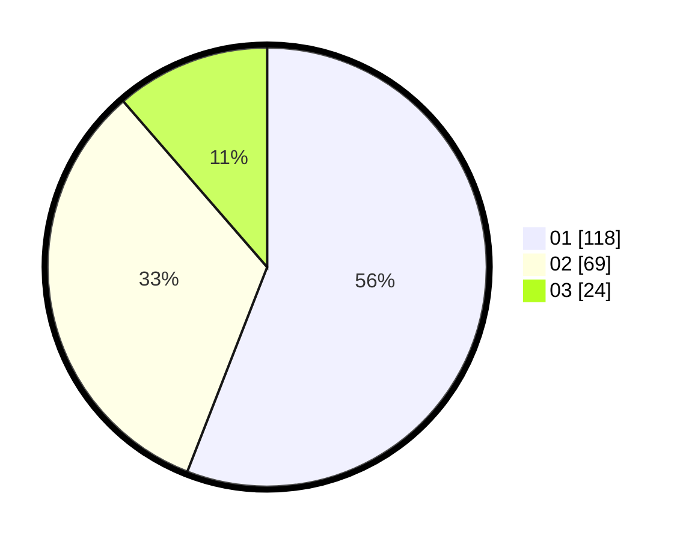

# Hasil

Hasil perolehan suara paslon dapat dilihat pada file paslon-01.txt, paslon-02.txt, dan paslon-03.txt.

Jika tidak ada, artinya data tersebut belum ada pada SIREKAP.

## Perolehan Suara

 * Paslon 01: **118**.
 * Paslon 02: **69**.
 * Paslon 03: **24**.

## Foto C Plano

https://sirekap-obj-formc.kpu.go.id/f1c7/pemilu/ppwp/31/75/03/10/01/3175031001054-20240214-191451--e81c3e4a-1701-4276-a971-3fdfd8c05b0f.jpg

https://sirekap-obj-formc.kpu.go.id/f1c7/pemilu/ppwp/31/75/03/10/01/3175031001054-20240214-191502--73846f4f-c348-4448-9bd5-4f0252d9d7cf.jpg

https://sirekap-obj-formc.kpu.go.id/f1c7/pemilu/ppwp/31/75/03/10/01/3175031001054-20240214-230212--7c0725f3-1d57-4abc-b56e-53a8c37ac8a0.jpg
