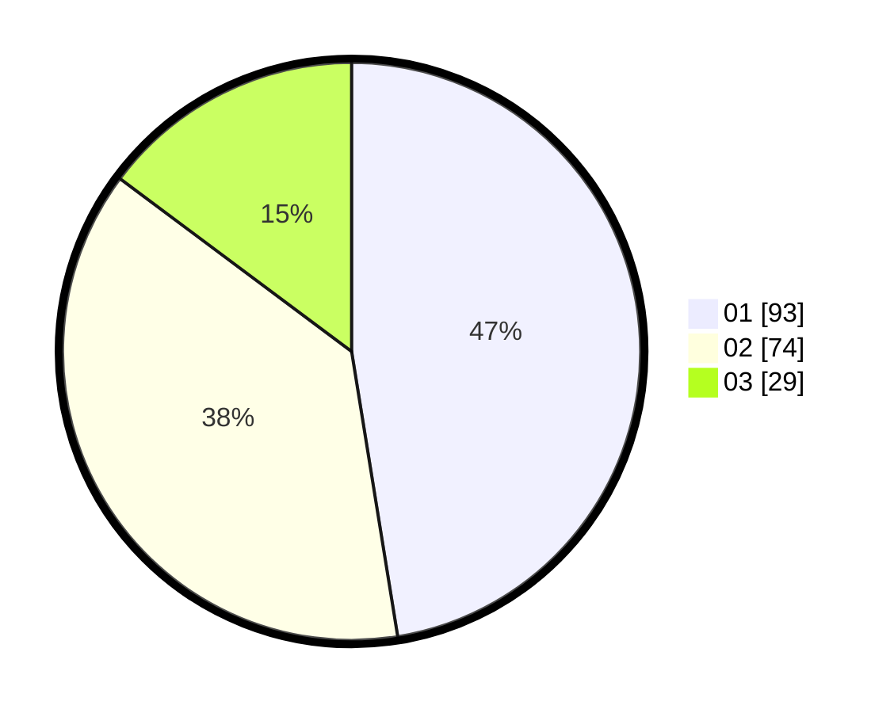

# Hasil

Hasil perolehan suara paslon dapat dilihat pada file paslon-01.txt, paslon-02.txt, dan paslon-03.txt.

Jika tidak ada, artinya data tersebut belum ada pada SIREKAP.

## Perolehan Suara

 * Paslon 01: **93**.
 * Paslon 02: **74**.
 * Paslon 03: **29**.

## Foto C Plano

https://sirekap-obj-formc.kpu.go.id/da98/pemilu/ppwp/31/75/03/10/01/3175031001055-20240216-094955--e8869438-0948-4566-8577-747a44d17ab2.jpg

https://sirekap-obj-formc.kpu.go.id/da98/pemilu/ppwp/31/75/03/10/01/3175031001055-20240216-094957--d0becfbd-00ef-4954-ab2f-b1ca5ba1fb21.jpg

https://sirekap-obj-formc.kpu.go.id/da98/pemilu/ppwp/31/75/03/10/01/3175031001055-20240216-094956--55abeaa8-7a87-4024-b307-fa7b71e2e6d8.jpg

## DATA PEMILIH TETAP

Jumlah pemilih dalam DPT: **266**.
 * L: **133**.
 * P: **133**.

## DATA PENGGUNA HAK PILIH

Jumlah pengguna hak pilih dalam DPT: **197**.
 * L: **95**.
 * P: **102**.

Jumlah pengguna hak pilih dalam DPTb: **0**.
 * L: **0**.
 * P: **0**.

Jumlah pengguna hak pilih dalam DPK: **0**.
 * L: **0**.
 * P: **0**.

Jumlah pengguna hak pilih: **197**.
 * L: **95**.
 * P: **102**.

## JUMLAH SUARA SAH DAN TIDAK SAH

JUMLAH SELURUH SUARA SAH: **196**.

JUMLAH SUARA TIDAK SAH: **1**.

JUMLAH SELURUH SUARA SAH DAN SUARA TIDAK SAH: **197**.
