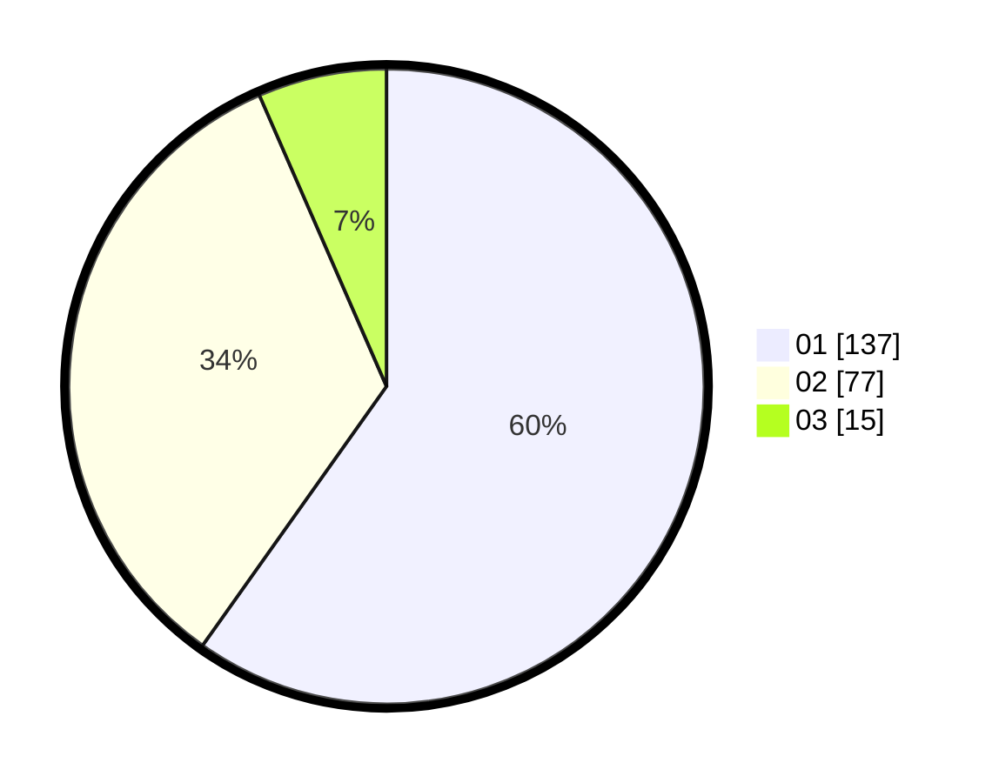

# Hasil

Hasil perolehan suara paslon dapat dilihat pada file paslon-01.txt, paslon-02.txt, dan paslon-03.txt.

Jika tidak ada, artinya data tersebut belum ada pada SIREKAP.

## Perolehan Suara

 * Paslon 01: **137**.
 * Paslon 02: **77**.
 * Paslon 03: **15**.

## Foto C Plano

https://sirekap-obj-formc.kpu.go.id/df80/pemilu/ppwp/31/75/03/10/01/3175031001058-20240216-020437--18ae50b8-66fc-46d0-accf-a082a9797e98.jpg

https://sirekap-obj-formc.kpu.go.id/df80/pemilu/ppwp/31/75/03/10/01/3175031001058-20240216-020439--1d9d1aff-9789-4cfd-96fa-c0c96bff5ee8.jpg

https://sirekap-obj-formc.kpu.go.id/df80/pemilu/ppwp/31/75/03/10/01/3175031001058-20240216-020438--62b9d9c9-044d-4a9d-b9a0-61d11295e832.jpg

## DATA PEMILIH TETAP

Jumlah pemilih dalam DPT: **231**.
 * L: **115**.
 * P: **116**.

## DATA PENGGUNA HAK PILIH

Jumlah pengguna hak pilih dalam DPT: **231**.
 * L: **115**.
 * P: **116**.

Jumlah pengguna hak pilih dalam DPTb: **0**.
 * L: **0**.
 * P: **0**.

Jumlah pengguna hak pilih dalam DPK: **0**.
 * L: **0**.
 * P: **0**.

Jumlah pengguna hak pilih: **233**.
 * L: **115**.
 * P: **118**.

## JUMLAH SUARA SAH DAN TIDAK SAH

JUMLAH SELURUH SUARA SAH: **229**.

JUMLAH SUARA TIDAK SAH: **4**.

JUMLAH SELURUH SUARA SAH DAN SUARA TIDAK SAH: **233**.
