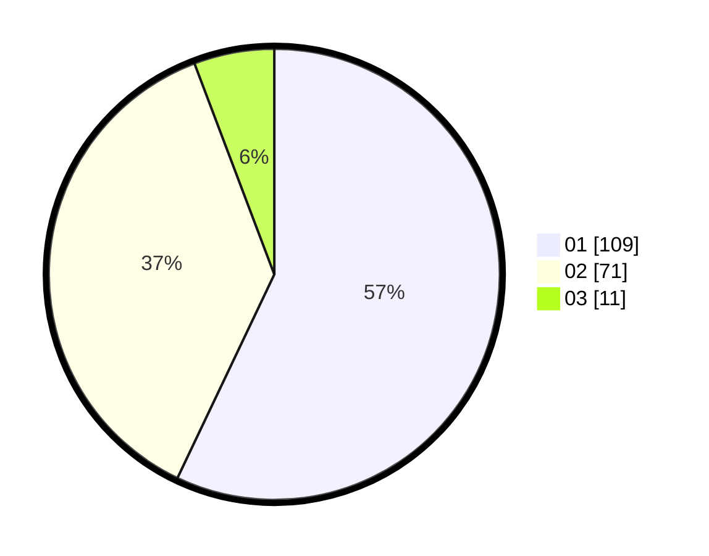

# Hasil

Hasil perolehan suara paslon dapat dilihat pada file paslon-01.txt, paslon-02.txt, dan paslon-03.txt.

Jika tidak ada, artinya data tersebut belum ada pada SIREKAP.

## Perolehan Suara

 * Paslon 01: **109**.
 * Paslon 02: **71**.
 * Paslon 03: **11**.

## Foto C Plano

https://sirekap-obj-formc.kpu.go.id/b664/pemilu/ppwp/31/75/03/10/01/3175031001065-20240214-222350--cbde0b72-3854-4811-8eae-ff787486f2ff.jpg

https://sirekap-obj-formc.kpu.go.id/b664/pemilu/ppwp/31/75/03/10/01/3175031001065-20240214-222702--12cdf5e2-1dd1-4ccc-9c48-8bf1c9732771.jpg

https://sirekap-obj-formc.kpu.go.id/b664/pemilu/ppwp/31/75/03/10/01/3175031001065-20240214-222752--28d5297f-d47f-48ee-85f1-7d2940453910.jpg
