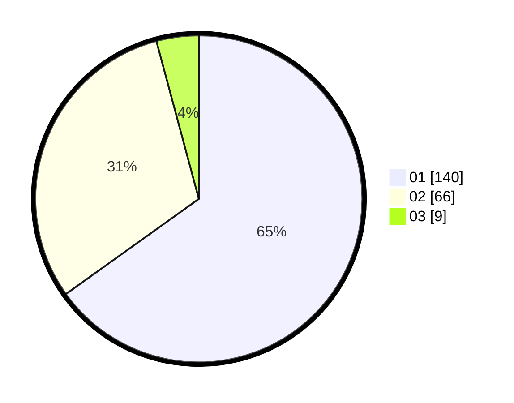

# Hasil

Hasil perolehan suara paslon dapat dilihat pada file paslon-01.txt, paslon-02.txt, dan paslon-03.txt.

Jika tidak ada, artinya data tersebut belum ada pada SIREKAP.

## Perolehan Suara

 * Paslon 01: **140**.
 * Paslon 02: **66**.
 * Paslon 03: **9**.

## Foto C Plano

https://sirekap-obj-formc.kpu.go.id/5105/pemilu/ppwp/31/75/03/10/01/3175031001068-20240214-193517--a3f42e1b-e5cb-4e6b-a417-dce46be57b36.jpg

https://sirekap-obj-formc.kpu.go.id/5105/pemilu/ppwp/31/75/03/10/01/3175031001068-20240214-193700--248b2c81-fe09-49d7-a77b-b60fe768612e.jpg

https://sirekap-obj-formc.kpu.go.id/5105/pemilu/ppwp/31/75/03/10/01/3175031001068-20240214-193846--c599c59c-1f0b-4fb4-ad8f-2f13982d975d.jpg

## DATA PEMILIH TETAP

Jumlah pemilih dalam DPT: **257**.
 * L: **130**.
 * P: **127**.

## DATA PENGGUNA HAK PILIH

Jumlah pengguna hak pilih dalam DPT: **213**.
 * L: **105**.
 * P: **108**.

Jumlah pengguna hak pilih dalam DPTb: **1**.
 * L: **0**.
 * P: **1**.

Jumlah pengguna hak pilih dalam DPK: **1**.
 * L: **0**.
 * P: **1**.

Jumlah pengguna hak pilih: **215**.
 * L: **105**.
 * P: **110**.

## JUMLAH SUARA SAH DAN TIDAK SAH

JUMLAH SELURUH SUARA SAH: **215**.

JUMLAH SUARA TIDAK SAH: **0**.

JUMLAH SELURUH SUARA SAH DAN SUARA TIDAK SAH: **215**.
