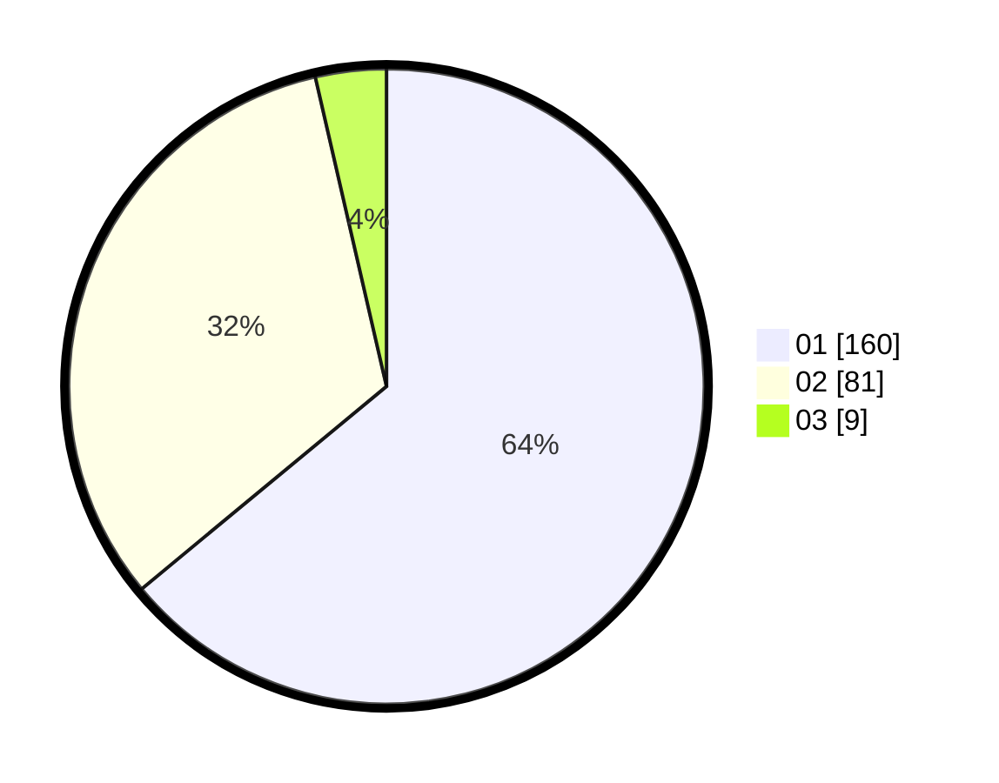

# Hasil

Hasil perolehan suara paslon dapat dilihat pada file paslon-01.txt, paslon-02.txt, dan paslon-03.txt.

Jika tidak ada, artinya data tersebut belum ada pada SIREKAP.

## Perolehan Suara

 * Paslon 01: **160**.
 * Paslon 02: **81**.
 * Paslon 03: **9**.

## Foto C Plano

https://sirekap-obj-formc.kpu.go.id/f63d/pemilu/ppwp/31/75/03/10/01/3175031001073-20240215-020513--15ae4e6f-57a0-4eda-87a5-7cccbefd304a.jpg

https://sirekap-obj-formc.kpu.go.id/f63d/pemilu/ppwp/31/75/03/10/01/3175031001073-20240215-020534--378a43d9-36dc-4ae4-8eaa-4cefe312b1dd.jpg

https://sirekap-obj-formc.kpu.go.id/f63d/pemilu/ppwp/31/75/03/10/01/3175031001073-20240215-020524--372a3c32-82e0-4b51-87a8-0f5645831d76.jpg

## DATA PEMILIH TETAP

Jumlah pemilih dalam DPT: **282**.
 * L: **147**.
 * P: **135**.

## DATA PENGGUNA HAK PILIH

Jumlah pengguna hak pilih dalam DPT: **251**.
 * L: **129**.
 * P: **122**.

Jumlah pengguna hak pilih dalam DPTb: **1**.
 * L: **0**.
 * P: **1**.

Jumlah pengguna hak pilih dalam DPK: **4**.
 * L: **1**.
 * P: **3**.

Jumlah pengguna hak pilih: **256**.
 * L: **130**.
 * P: **126**.

## JUMLAH SUARA SAH DAN TIDAK SAH

JUMLAH SELURUH SUARA SAH: **0**.

JUMLAH SUARA TIDAK SAH: **6**.

JUMLAH SELURUH SUARA SAH DAN SUARA TIDAK SAH: **256**.
