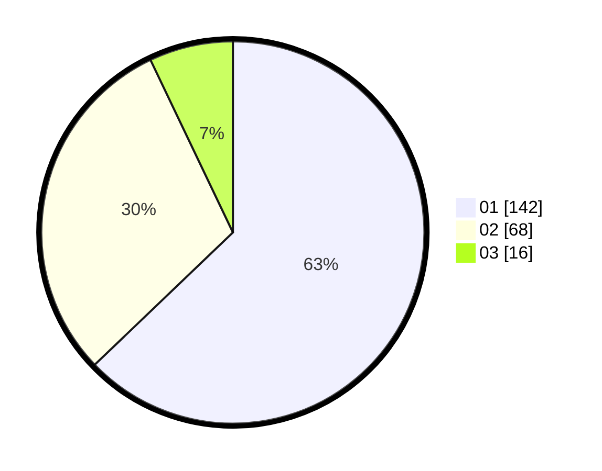

# Hasil

Hasil perolehan suara paslon dapat dilihat pada file paslon-01.txt, paslon-02.txt, dan paslon-03.txt.

Jika tidak ada, artinya data tersebut belum ada pada SIREKAP.

## Perolehan Suara

 * Paslon 01: **142**.
 * Paslon 02: **68**.
 * Paslon 03: **16**.

## Foto C Plano

https://sirekap-obj-formc.kpu.go.id/1a29/pemilu/ppwp/31/75/03/10/01/3175031001081-20240214-214333--6240f675-cb05-4ac3-83ab-0af1ae48dcef.jpg

https://sirekap-obj-formc.kpu.go.id/1a29/pemilu/ppwp/31/75/03/10/01/3175031001081-20240214-214232--2d5ef804-ccb9-4e5d-9c93-5a686e7eb6ba.jpg

https://sirekap-obj-formc.kpu.go.id/1a29/pemilu/ppwp/31/75/03/10/01/3175031001081-20240214-214300--4c620d4c-8862-4cd7-8257-8f190873c413.jpg
