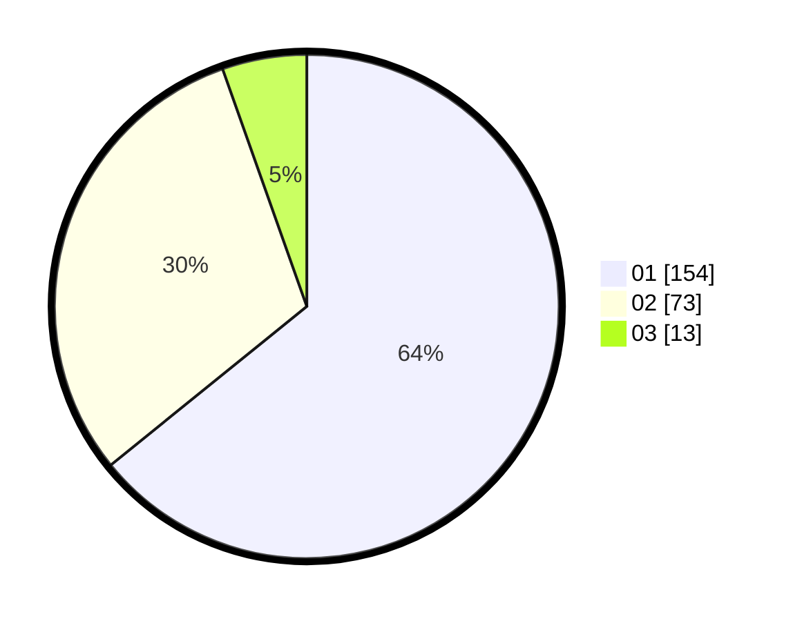

# Hasil

Hasil perolehan suara paslon dapat dilihat pada file paslon-01.txt, paslon-02.txt, dan paslon-03.txt.

Jika tidak ada, artinya data tersebut belum ada pada SIREKAP.

## Perolehan Suara

 * Paslon 01: **154**.
 * Paslon 02: **73**.
 * Paslon 03: **13**.

## Foto C Plano

https://sirekap-obj-formc.kpu.go.id/a9ea/pemilu/ppwp/31/75/03/10/01/3175031001086-20240215-034200--aee97114-095b-4598-b027-5ea753d6e629.jpg

https://sirekap-obj-formc.kpu.go.id/a9ea/pemilu/ppwp/31/75/03/10/01/3175031001086-20240215-034403--1d7fde6e-79f1-46a3-b217-afae7d24de49.jpg

https://sirekap-obj-formc.kpu.go.id/a9ea/pemilu/ppwp/31/75/03/10/01/3175031001086-20240215-034523--83e664f2-6ac5-4506-acc0-96cb89c52995.jpg
