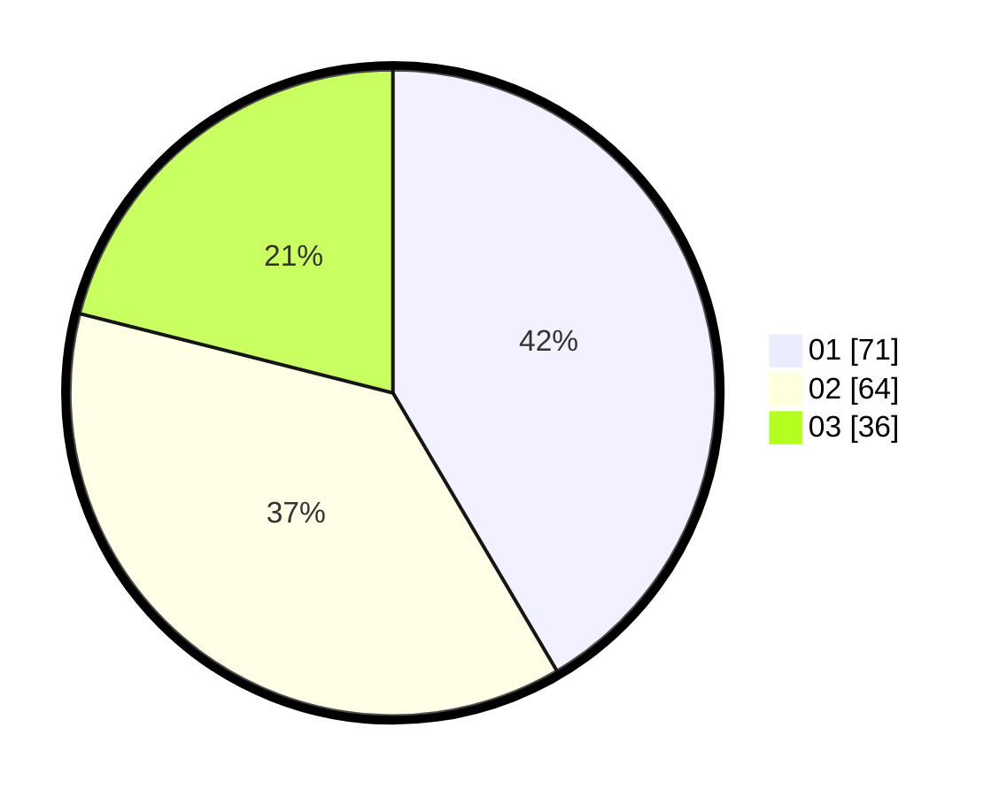

# Hasil

Hasil perolehan suara paslon dapat dilihat pada file paslon-01.txt, paslon-02.txt, dan paslon-03.txt.

Jika tidak ada, artinya data tersebut belum ada pada SIREKAP.

## Perolehan Suara

 * Paslon 01: **71**.
 * Paslon 02: **64**.
 * Paslon 03: **36**.

## Foto C Plano

https://sirekap-obj-formc.kpu.go.id/64c3/pemilu/ppwp/31/75/03/10/02/3175031002003-20240215-002349--7da5abf1-a587-4cd0-93a6-7c297b16737e.jpg

https://sirekap-obj-formc.kpu.go.id/64c3/pemilu/ppwp/31/75/03/10/02/3175031002003-20240215-002530--baa2ac25-f4d8-4ed1-a66d-b8a38d4d740d.jpg

https://sirekap-obj-formc.kpu.go.id/64c3/pemilu/ppwp/31/75/03/10/02/3175031002003-20240216-150849--d4e13f6d-a6a5-4cab-a86c-6cbfec506c9a.jpg

## DATA PEMILIH TETAP

Jumlah pemilih dalam DPT: **277**.
 * L: **128**.
 * P: **149**.

## DATA PENGGUNA HAK PILIH

Jumlah pengguna hak pilih dalam DPT: **149**.
 * L: **67**.
 * P: **82**.

Jumlah pengguna hak pilih dalam DPTb: **22**.
 * L: **12**.
 * P: **10**.

Jumlah pengguna hak pilih dalam DPK: **1**.
 * L: **1**.
 * P: **0**.

Jumlah pengguna hak pilih: **172**.
 * L: **80**.
 * P: **92**.

## JUMLAH SUARA SAH DAN TIDAK SAH

JUMLAH SELURUH SUARA SAH: **171**.

JUMLAH SUARA TIDAK SAH: **1**.

JUMLAH SELURUH SUARA SAH DAN SUARA TIDAK SAH: **172**.
