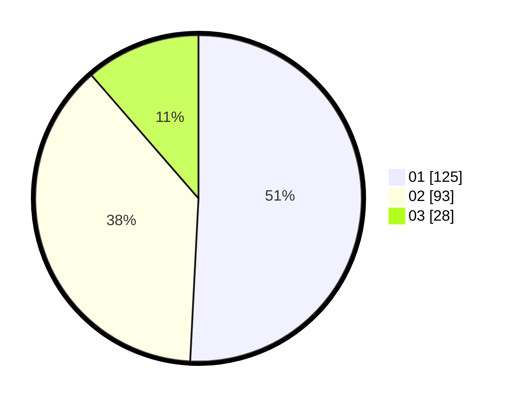

# Hasil

Hasil perolehan suara paslon dapat dilihat pada file paslon-01.txt, paslon-02.txt, dan paslon-03.txt.

Jika tidak ada, artinya data tersebut belum ada pada SIREKAP.

## Perolehan Suara

 * Paslon 01: **125**.
 * Paslon 02: **93**.
 * Paslon 03: **28**.

## Foto C Plano

https://sirekap-obj-formc.kpu.go.id/eaa4/pemilu/ppwp/31/75/03/10/02/3175031002011-20240214-213358--99295a86-0644-421a-88f1-0a6313115953.jpg

https://sirekap-obj-formc.kpu.go.id/eaa4/pemilu/ppwp/31/75/03/10/02/3175031002011-20240214-213429--47c1cfa2-6ab3-490a-a3ee-67bc8c1349e5.jpg

https://sirekap-obj-formc.kpu.go.id/eaa4/pemilu/ppwp/31/75/03/10/02/3175031002011-20240214-213531--77bde0ea-3fea-422f-b9ed-91df5d10f458.jpg
