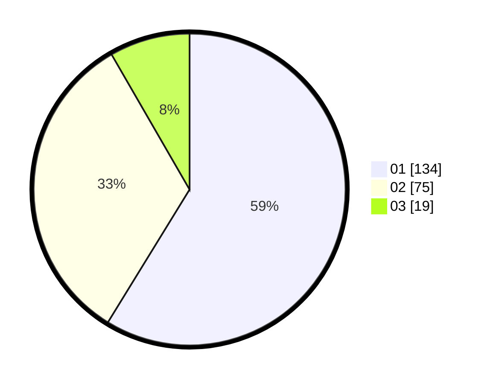

# Hasil

Hasil perolehan suara paslon dapat dilihat pada file paslon-01.txt, paslon-02.txt, dan paslon-03.txt.

Jika tidak ada, artinya data tersebut belum ada pada SIREKAP.

## Perolehan Suara

 * Paslon 01: **134**.
 * Paslon 02: **75**.
 * Paslon 03: **19**.

## Foto C Plano

https://sirekap-obj-formc.kpu.go.id/1c5d/pemilu/ppwp/31/75/03/10/02/3175031002012-20240216-015933--d4a174e0-ebb9-4c01-bf39-e8ee9413fdaf.jpg

https://sirekap-obj-formc.kpu.go.id/1c5d/pemilu/ppwp/31/75/03/10/02/3175031002012-20240216-065748--16851966-9d1e-4ad6-800d-92da24c8e28f.jpg

https://sirekap-obj-formc.kpu.go.id/1c5d/pemilu/ppwp/31/75/03/10/02/3175031002012-20240216-015934--dc846bd8-2d9a-476d-9b6e-a17e050300b4.jpg

## DATA PEMILIH TETAP

Jumlah pemilih dalam DPT: **257**.
 * L: **129**.
 * P: **128**.

## DATA PENGGUNA HAK PILIH

Jumlah pengguna hak pilih dalam DPT: **216**.
 * L: **103**.
 * P: **113**.

Jumlah pengguna hak pilih dalam DPTb: **13**.
 * L: **6**.
 * P: **7**.

Jumlah pengguna hak pilih dalam DPK: **1**.
 * L: **1**.
 * P: **0**.

Jumlah pengguna hak pilih: **230**.
 * L: **110**.
 * P: **120**.

## JUMLAH SUARA SAH DAN TIDAK SAH

JUMLAH SELURUH SUARA SAH: **228**.

JUMLAH SUARA TIDAK SAH: **2**.

JUMLAH SELURUH SUARA SAH DAN SUARA TIDAK SAH: **230**.
