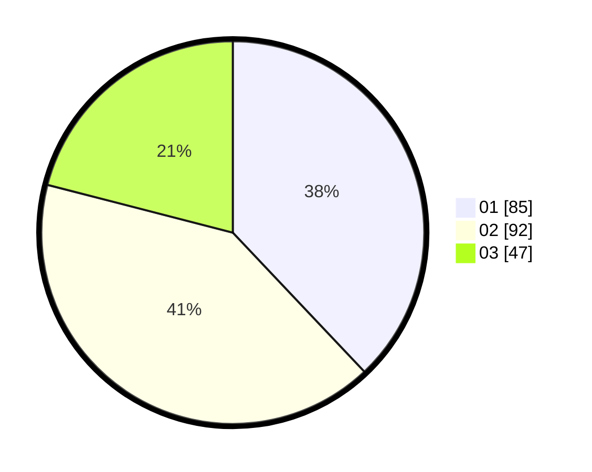

# Hasil

Hasil perolehan suara paslon dapat dilihat pada file paslon-01.txt, paslon-02.txt, dan paslon-03.txt.

Jika tidak ada, artinya data tersebut belum ada pada SIREKAP.

## Perolehan Suara

 * Paslon 01: **85**.
 * Paslon 02: **92**.
 * Paslon 03: **47**.

## Foto C Plano

https://sirekap-obj-formc.kpu.go.id/2e6f/pemilu/ppwp/31/75/03/10/02/3175031002013-20240215-224724--d2aac679-e949-4367-ae35-9ecb24f3c045.jpg

https://sirekap-obj-formc.kpu.go.id/2e6f/pemilu/ppwp/31/75/03/10/02/3175031002013-20240215-224726--5bb591f4-3e04-41d7-9045-f12689745f30.jpg

https://sirekap-obj-formc.kpu.go.id/2e6f/pemilu/ppwp/31/75/03/10/02/3175031002013-20240215-224725--6997f411-07ba-417a-b4c2-0e0ee80e247b.jpg

## DATA PEMILIH TETAP

Jumlah pemilih dalam DPT: **249**.
 * L: **129**.
 * P: **120**.

## DATA PENGGUNA HAK PILIH

Jumlah pengguna hak pilih dalam DPT: **210**.
 * L: **108**.
 * P: **102**.

Jumlah pengguna hak pilih dalam DPTb: **17**.
 * L: **14**.
 * P: **3**.

Jumlah pengguna hak pilih dalam DPK: **1**.
 * L: **0**.
 * P: **1**.

Jumlah pengguna hak pilih: **228**.
 * L: **122**.
 * P: **106**.

## JUMLAH SUARA SAH DAN TIDAK SAH

JUMLAH SELURUH SUARA SAH: **224**.

JUMLAH SUARA TIDAK SAH: **4**.

JUMLAH SELURUH SUARA SAH DAN SUARA TIDAK SAH: **228**.
