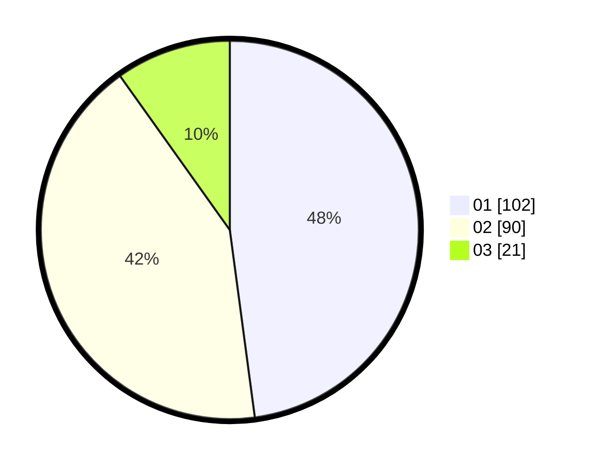

# Hasil

Hasil perolehan suara paslon dapat dilihat pada file paslon-01.txt, paslon-02.txt, dan paslon-03.txt.

Jika tidak ada, artinya data tersebut belum ada pada SIREKAP.

## Perolehan Suara

 * Paslon 01: **102**.
 * Paslon 02: **90**.
 * Paslon 03: **21**.

## Foto C Plano

https://sirekap-obj-formc.kpu.go.id/7afa/pemilu/ppwp/31/75/03/10/02/3175031002023-20240214-200023--580a225f-065f-4a0f-af68-72e9ffdfb90d.jpg

https://sirekap-obj-formc.kpu.go.id/7afa/pemilu/ppwp/31/75/03/10/02/3175031002023-20240214-200108--f4180b7f-2ac6-49b3-9491-a2b4779c3231.jpg

https://sirekap-obj-formc.kpu.go.id/7afa/pemilu/ppwp/31/75/03/10/02/3175031002023-20240214-201300--62d9a406-e27a-4ad4-a9fa-ba42a1ea46e3.jpg
