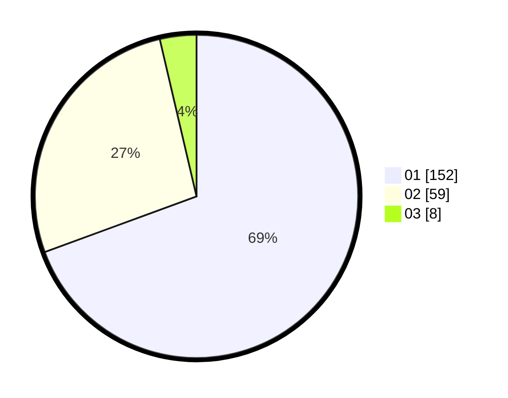

# Hasil

Hasil perolehan suara paslon dapat dilihat pada file paslon-01.txt, paslon-02.txt, dan paslon-03.txt.

Jika tidak ada, artinya data tersebut belum ada pada SIREKAP.

## Perolehan Suara

 * Paslon 01: **152**.
 * Paslon 02: **59**.
 * Paslon 03: **8**.

## Foto C Plano

https://sirekap-obj-formc.kpu.go.id/a635/pemilu/ppwp/31/75/03/10/02/3175031002025-20240215-035907--7b774f26-7c9f-4db9-b2a6-22eff271f95d.jpg

https://sirekap-obj-formc.kpu.go.id/a635/pemilu/ppwp/31/75/03/10/02/3175031002025-20240215-040026--e51c627e-572c-4c84-b84f-9eafeaa3c962.jpg

https://sirekap-obj-formc.kpu.go.id/a635/pemilu/ppwp/31/75/03/10/02/3175031002025-20240215-040131--d9c5ada3-f3fc-48f8-bdc0-2a0c616e2975.jpg
