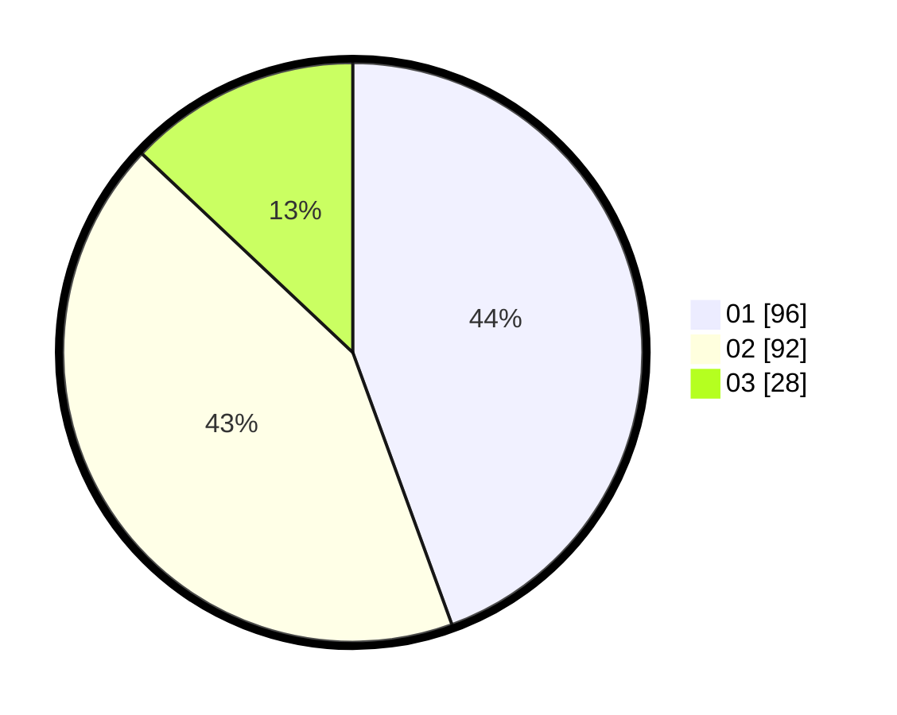

# Hasil

Hasil perolehan suara paslon dapat dilihat pada file paslon-01.txt, paslon-02.txt, dan paslon-03.txt.

Jika tidak ada, artinya data tersebut belum ada pada SIREKAP.

## Perolehan Suara

 * Paslon 01: **96**.
 * Paslon 02: **92**.
 * Paslon 03: **28**.

## Foto C Plano

https://sirekap-obj-formc.kpu.go.id/cce8/pemilu/ppwp/31/75/03/10/02/3175031002028-20240214-202203--9beb6453-5f1e-4078-9d30-456652030cb4.jpg

https://sirekap-obj-formc.kpu.go.id/cce8/pemilu/ppwp/31/75/03/10/02/3175031002028-20240214-200622--a7742b48-3ada-45f3-a69d-f610c7c3e538.jpg

https://sirekap-obj-formc.kpu.go.id/cce8/pemilu/ppwp/31/75/03/10/02/3175031002028-20240214-200707--1428a6b9-616b-4abb-a648-9f946fcc27bc.jpg
