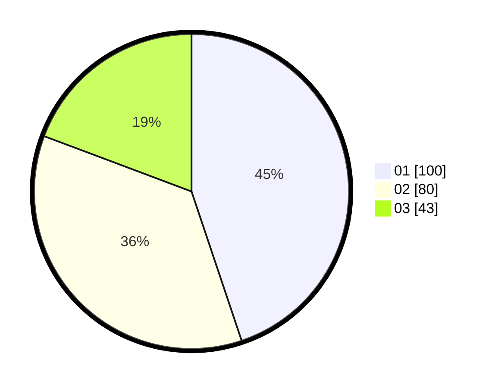

# Hasil

Hasil perolehan suara paslon dapat dilihat pada file paslon-01.txt, paslon-02.txt, dan paslon-03.txt.

Jika tidak ada, artinya data tersebut belum ada pada SIREKAP.

## Perolehan Suara

 * Paslon 01: **100**.
 * Paslon 02: **80**.
 * Paslon 03: **43**.

## Foto C Plano

https://sirekap-obj-formc.kpu.go.id/5ece/pemilu/ppwp/31/75/03/10/02/3175031002040-20240214-190703--da3ab928-35a2-4166-89ec-57dae0aa80bb.jpg

https://sirekap-obj-formc.kpu.go.id/5ece/pemilu/ppwp/31/75/03/10/02/3175031002040-20240215-014807--38281c79-f5dc-4c43-b640-4411eded94d1.jpg

https://sirekap-obj-formc.kpu.go.id/5ece/pemilu/ppwp/31/75/03/10/02/3175031002040-20240215-015116--a1a5b5aa-3171-4f04-ae8f-07e6bb36ed10.jpg
