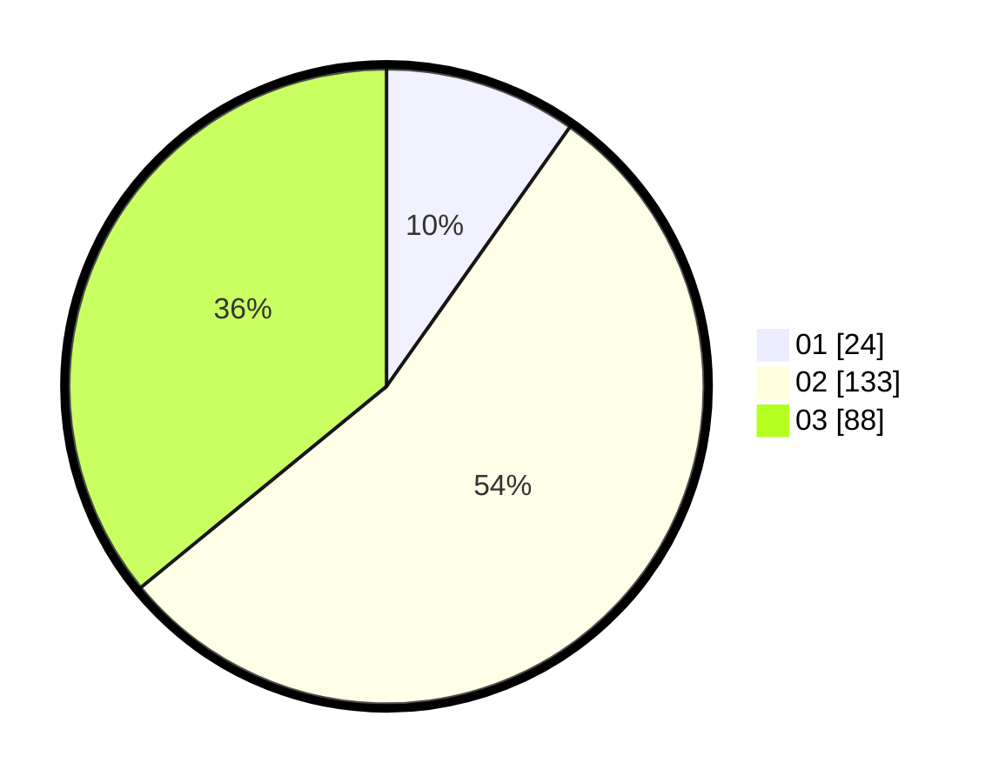

# Hasil

Hasil perolehan suara paslon dapat dilihat pada file paslon-01.txt, paslon-02.txt, dan paslon-03.txt.

Jika tidak ada, artinya data tersebut belum ada pada SIREKAP.

## Perolehan Suara

 * Paslon 01: **24**.
 * Paslon 02: **133**.
 * Paslon 03: **88**.

## Foto C Plano

https://sirekap-obj-formc.kpu.go.id/2fbc/pemilu/ppwp/31/75/03/10/02/3175031002042-20240214-220757--1404f5f3-771b-4cf6-a300-c340b7bcb0bb.jpg

https://sirekap-obj-formc.kpu.go.id/2fbc/pemilu/ppwp/31/75/03/10/02/3175031002042-20240214-220836--71007a6d-ed9c-4dde-a400-3ff888a608fd.jpg

https://sirekap-obj-formc.kpu.go.id/2fbc/pemilu/ppwp/31/75/03/10/02/3175031002042-20240214-221000--f9a45549-06a8-4b08-a2a0-f33eb33b29fb.jpg
