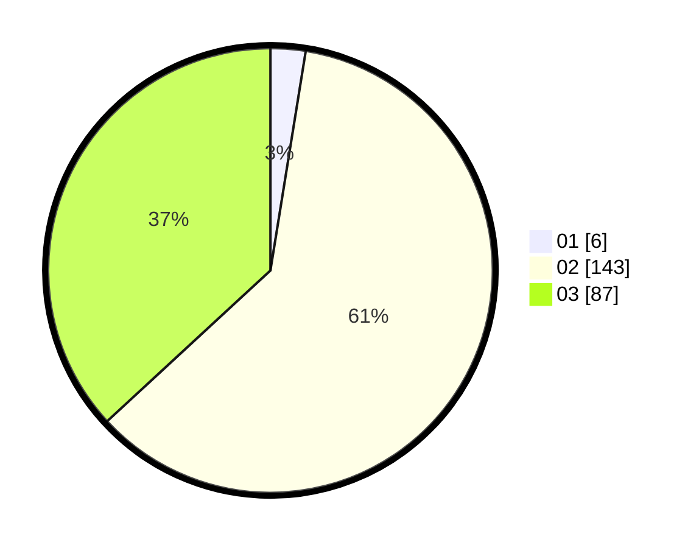

# Hasil

Hasil perolehan suara paslon dapat dilihat pada file paslon-01.txt, paslon-02.txt, dan paslon-03.txt.

Jika tidak ada, artinya data tersebut belum ada pada SIREKAP.

## Perolehan Suara

 * Paslon 01: **6**.
 * Paslon 02: **143**.
 * Paslon 03: **87**.

## Foto C Plano

https://sirekap-obj-formc.kpu.go.id/dcd5/pemilu/ppwp/31/75/03/10/02/3175031002043-20240214-231324--086664cd-b8bf-4f20-adfb-8799b8ba0e9b.jpg

https://sirekap-obj-formc.kpu.go.id/dcd5/pemilu/ppwp/31/75/03/10/02/3175031002043-20240214-231457--f1ab4e5f-d683-4459-ba61-fc65d3c4c41a.jpg

https://sirekap-obj-formc.kpu.go.id/dcd5/pemilu/ppwp/31/75/03/10/02/3175031002043-20240214-231849--04faf315-e71f-4e80-8449-5774afbce9ff.jpg
